# 启智云系统架构全景图

> 组织逻辑：以《架构部分描述》四层结构为骨架，补充业务含义与模块间联系。  
> docs-selected 提供业务视角理解，docs/ 仅补充事实细节，不做概念判断。

---

## 架构全景图（Mermaid）

```mermaid
flowchart TD
    %% ============================================================
    %% 系统定位
    %% ============================================================
    SYS["🎯 系统定位<br/>把静态课件变成可交互、可续接、可统计的动态学习内容<br/>教师掌握学情、学生连续学习、平台可嵌入"]

    %% ============================================================
    %% 第一层：AI 业务能力层
    %% ============================================================
    subgraph L1["第一层：AI 业务能力层 — 直接服务教学场景"]
        direction TB

        subgraph C1["课件理解中心"]
            C1A["课件上传与拆页"]
            C1B["VLM 多模态结构化解析<br/>← 识别公式、图表、流程图"]
            C1C["跨页语义聚合<br/>← 三阶段解耦，避免大模型遗忘前文"]
            C1D["知识对象生成与标准化校验"]
            C1E["结构化输出<br/>课程标题 · 知识点 · 章节结构 · 案例内容 · 互动素材"]
        end
        C1A --> C1B --> C1C --> C1D --> C1E

        subgraph C2["知识检索中心"]
            C2A["意图识别"]
            C2B["课程知识优先检索<br/>← 减少大模型幻觉"]
            C2C["语义召回与上下文构建"]
        end
        C2A --> C2B --> C2C

        subgraph C3["教学内容生成中心"]
            C3A["教学脚本生成<br/>← 开场白 · 讲解 · 过渡语"]
            C3B["课堂互动问题生成"]
            C3C["课程总结与知识讲解生成"]
        end
        C3A --> C3B --> C3C

        subgraph C4["智能问答中心"]
            C4A["问题输入与上下文拼接<br/>← 本页优先 + 当前节点 + 历史对话"]
            C4B["上下文增强生成<br/>← 苏格拉底式引导，非直接给答案"]
            C4C["回答输出与溯源<br/>← 绑定课件页码，降低幻觉"]
            C4D["理解程度判定<br/>← 已懂 / 部分理解 / 未懂 三态"]
            C4E["续接策略选择<br/>← 续讲 / 补充后续讲 / 回退重讲"]
        end
        C4A --> C4B --> C4C
        C4C --> C4D --> C4E

        subgraph C5["语音交互中心"]
            C5A["文本转语音合成"]
            C5B["AI 讲解播报"]
            C5C["答疑语音播报"]
        end
        C5A --> C5B --> C5C

        subgraph C6["学习分析中心 — 预留扩展"]
            C6A["学习进度记录"]
            C6B["提问与互动记录"]
            C6C["答题记录"]
            C6D["参与度 · 掌握度 · 学习建议"]
        end
        C6A --> C6B --> C6C --> C6D
    end

    %% ============================================================
    %% 第二层：AI 工作流编排层
    %% ============================================================
    subgraph L2["第二层：AI 工作流编排层 — Dify"]
        direction TB

        WF_ROLE["统一管理 AI 调用链路<br/>编排模型与工具协同<br/>控制流程状态与异常处理"]

        subgraph W1["课件解析工作流"]
            W1A["上传课件"] --> W1B["解析"] --> W1C["结构化"] --> W1D["校验"] --> W1E["入库"]
        end

        subgraph W2["知识入库工作流"]
            W2A["切片"] --> W2B["向量化"] --> W2C["索引构建"]
        end

        subgraph W3["智能问答工作流"]
            W3A["问题输入"] --> W3B["知识检索"] --> W3C["上下文增强"] --> W3D["LLM 生成"] --> W3E["返回结果"]
        end

        subgraph W4["脚本生成工作流"]
            W4A["节点内容输入"] --> W4B["脚本生成"] --> W4C["音频生成"]
        end

        subgraph W5["语音生成工作流"]
            W5A["文本输入"] --> W5B["TTS 合成"] --> W5C["音频与时长输出"]
        end
    end

    %% ============================================================
    %% 第三层：模型与工具能力层
    %% ============================================================
    subgraph L3["第三层：模型与工具能力层 — 具体执行者"]
        direction LR
        M1["通义千问 LLM<br/>自然语言理解 · 内容生成 · 问答推理"]
        M2["VLM 视觉理解模型<br/>课件图片理解 · 图文提取 · 结构化生成"]
        M3["TTS 语音合成服务<br/>文本转语音 · 多音色支持"]
        M4["Python 解析引擎<br/>PPT 解析 · PDF 解析 · 结构化转换 · 标准化校验"]
        M5["知识库检索服务<br/>FAISS · LanceDB · pgvector<br/>课程知识切片与语义召回"]
    end

    %% ============================================================
    %% 第四层：数据支撑层
    %% ============================================================
    subgraph L4["第四层：数据支撑层"]
        direction LR
        DB1[("PostgreSQL<br/>课程 · 页面 · 讲稿 · 用户 · 学习记录 · 会话")]
        DB2[("Redis<br/>会话状态 · 解析任务队列 · 进度游标 · 语义缓存")]
        DB3[("MinIO<br/>课件原文件 · 页预览图 · TTS 音频 · 解析结果")]
    end

    %% ============================================================
    %% 业务闭环：教师端与学生端（跨层交互）
    %% ============================================================
    subgraph BIZ["业务闭环：双端如何消费与反哺"]
        direction TB

        subgraph T["教师端"]
            T1["上传课件"]
            T2["审阅编辑讲稿"]
            T3["发布课程"]
            T4["查看学情面板<br/>提问分布 · 卡点热点 · 理解程度分布"]
            T5["做出教学决策<br/>补讲 · 分层辅导 · 持续追踪"]
        end
        T1 --> T2 --> T3 --> T4 --> T5

        subgraph S["学生端"]
            S1["进入学习<br/>断点恢复 / 从头开始"]
            S2["按节点听讲"]
            S3["遇疑提问"]
            S4["获得上下文回答 + 溯源"]
            S5["理解程度判定 + 续接位置"]
            S6["从续接位置继续学习"]
        end
        S1 --> S2 --> S3 --> S4 --> S5 --> S6

        FEEDBACK["📊 学情回传"]
    end

    %% ============================================================
    %% 关键连线：模块间联系
    %% ============================================================

    SYS --> L1

    %% === 第一层内部：能力中心之间的依赖关系 ===
    C1E ==>|"解析产出的知识对象<br/>是生成与检索的前提"| C2A
    C1E ==>|"结构化知识入库<br/>供检索中心召回"| C2C
    C1E ==>|"页级内容与节点结构<br/>驱动脚本生成"| C3A
    C2C ==>|"检索到的上下文<br/>增强生成质量"| C3A
    C2C ==>|"课程知识优先检索<br/>降低问答幻觉"| C4A
    C4C ==>|"理解程度与提问记录<br/>喂给学情分析"| C6A
    C4E ==>|"续接位置决定<br/>学生继续学习起点"| S5
    C5A -.->|"语音输入转文本后<br/>进入问答流程"| C4A
    C3A ==>|"讲稿文本需要语音合成<br/>才能形成完整讲授"| C5A

    %% === 第一层 → 第二层：业务能力通过工作流落地 ===
    C1D --> W1
    C2B --> W2
    C4B --> W3
    C3A --> W4
    C5A --> W5

    %% === 第二层 → 第三层：工作流调用模型执行 ===
    W1B --> M2
    W1B --> M4
    W1C --> M1
    W2B --> M5
    W3B --> M5
    W3D --> M1
    W4B --> M1
    W5B --> M3

    %% === 第二层 → 第四层：工作流读写数据 ===
    W1E --> DB1
    W2C --> DB2
    W3A --> DB2
    W4C --> DB3

    %% === 第三层 → 第四层：模型读写数据 ===
    M5 <--> DB2
    M4 --> DB1

    %% === 业务闭环：教师端与底座的交互 ===
    T1 ==>|"上传课件触发解析"| C1A
    T2 ==>|"编辑讲稿调用生成"| C3A
    T3 ==>|"发布后学生可学习"| S1
    T5 ==>|"补讲修改讲稿"| C3A

    %% === 业务闭环：学生端与底座的交互 ===
    S3 ==>|"提问进入问答"| C4A
    S4 ==>|"回答来源溯源"| C4C

    %% === 学情回传：学生端 → 教师端 ===
    S4 -.->|"提问记录 · 理解程度"| FEEDBACK
    S5 -.->|"续接数据 · 卡点分布"| FEEDBACK
    S2 -.->|"学习进度 · 断点位置"| FEEDBACK
    FEEDBACK -.->|"学情面板数据"| T4

    %% === 第一层内部补充：知识入库是解析的下游 ===
    C1E ==>|"解析结果入库后<br/>才支撑检索与生成"| C2A

    %% === 样式 ===
    classDef sys fill:#1e293b,stroke:#475569,stroke-width:2px,color:#f1f5f9
    classDef center fill:#e0f2fe,stroke:#0284c7,stroke-width:2px,color:#0c4a6e
    classDef flow fill:#fef3c7,stroke:#d97706,stroke-width:1px,color:#92400e
    classDef model fill:#d1fae5,stroke:#059669,stroke-width:2px,color:#064e3b
    classDef data fill:#fce7f3,stroke:#db2777,stroke-width:2px,color:#831843
    classDef teacher fill:#dbeafe,stroke:#3b82f6,stroke-width:2px,color:#1e40af
    classDef student fill:#fef9c3,stroke:#ca8a04,stroke-width:2px,color:#713f12
    classDef feedback fill:#fecaca,stroke:#dc2626,stroke-width:2px,color:#7f1d1d

    class SYS sys
    class C1,C1A,C1B,C1C,C1D,C1E,C2,C2A,C2B,C2C,C3,C3A,C3B,C3C,C4,C4A,C4B,C4C,C4D,C4E,C5,C5A,C5B,C5C,C6,C6A,C6B,C6C,C6D center
    class W1,W1A,W1B,W1C,W1D,W1E,W2,W2A,W2B,W2C,W3,W3A,W3B,W3C,W3D,W3E,W4,W4A,W4B,W4C,W5,W5A,W5B,W5C,WF_ROLE flow
    class M1,M2,M3,M4,M5 model
    class DB1,DB2,DB3 data
    class T,T1,T2,T3,T4,T5 teacher
    class S,S1,S2,S3,S4,S5,S6 student
    class FEEDBACK feedback
```

---

## 图中发现的模块间联系

以下联系不是源文档直接标注的，而是通过理解各模块职责与业务场景后发现的：

### 第一层内部：能力中心之间的依赖

| 联系 | 方向 | 含义 |
|------|------|------|
| 课件理解 → 知识检索 | 解析产出是检索的前提 | 课件解析后生成知识对象入库，检索中心才能基于课程知识做优先召回 |
| 课件理解 → 教学内容生成 | 结构化内容驱动脚本 | 没有页级内容和节点结构，生成中心无法产出按页、按节点的讲稿 |
| 课件理解 → 知识检索（入库） | 解析结果入库供召回 | 解析不仅产出结构，还要切片索引化，后续问答和生成都依赖检索 |
| 知识检索 → 教学内容生成 | 检索增强生成质量 | 生成脚本时需要检索相关知识点做上下文补充 |
| 知识检索 → 智能问答 | 课程知识优先召回降低幻觉 | 问答的核心前提是检索到正确上下文，否则退化为通用聊天 |
| 智能问答 → 学习分析 | 问答数据喂给学情 | 学情不只是统计日志，需要把提问内容、理解程度与知识节点绑定 |
| 语音交互 → 智能问答 | 语音输入需要转文本进入问答 | 语音播报和语音输入是问答的前置与后置环节 |
| 教学内容生成 → 语音交互 | 讲稿需要语音合成才能完整讲授 | 脚本只有文本不够，还需要 TTS 生成音频和时间轴 |

### 跨层联系

| 层级关系 | 含义 |
|----------|------|
| 业务能力层 → 工作流编排层 | 6个能力中心的实际执行通过 Dify 工作流编排落地 |
| 工作流编排层 → 模型与工具层 | 工作流调用具体模型和工具完成计算任务 |
| 工作流编排层 → 数据支撑层 | 工作流的输入输出需要持久化和缓存 |
| 模型与工具层 → 数据支撑层 | 模型执行需要读写存储（向量化索引、解析结果、音频文件） |

### 业务闭环联系

| 联系 | 含义 |
|------|------|
| 教师上传课件 → 触发课件理解中心 | 教师端是解析链路的起点 |
| 教师编辑讲稿 → 调用教学内容生成中心 | 教师审阅是生成结果的质量把控 |
| 教师发布课程 → 学生可开始学习 | 发布是内容从生产侧到消费侧的分界点 |
| 学生提问 → 进入智能问答中心 | 学生端是问答的消费入口 |
| 问答续接位置 → 学生继续学习起点 | 续接是教学过程不断裂的核心机制 |
| 学生学习行为 → 学情回传 → 教师学情面板 | 这是教师端和学生端最关键的闭环连接 |
| 教师补讲决策 → 重新调用生成中心修改讲稿 | 学情反馈驱动内容优化，形成迭代 |

---

## 关键设计决策（补充说明）

| 决策 | 为什么这样设计 |
|------|---------------|
| 三阶段解析 pipeline | 单次生成 LLM 会遗忘前文，跨页语义聚合质量差；解耦后每阶段可独立优化 |
| segment 级讲稿粒度 | 传统整页讲稿打断后只能从头续接；segment 级允许按理解程度精确定位续接点 |
| 本页优先检索策略 | 通用检索容易跑偏，本页优先保证答案与当前学习位置强相关，降低幻觉 |
| 理解度三态判定 | 关键词匹配精度低（对话千变万化）；LLM 综合判断问题语义、课件内容和历史上下文更准确 |
| SSE 流式输出 | 典型问答耗时 3-5 秒，HTTP 等全部生成完才返回体感差；SSE 首 token 0.5 秒到达 |
| 节点作为统一语言 | 教师编辑节点、学生播放节点、问答引用节点、学情统计节点——只有节点统一，四条链路才能对齐 |
| AI 作为适配层而非架构中心 | LLM、VLM、TTS 都可替换；不可替换的是节点化模型、续接策略和学情沉淀模型 |