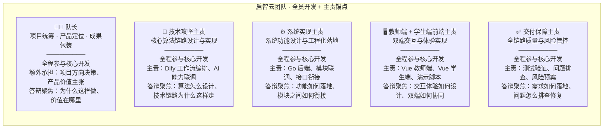
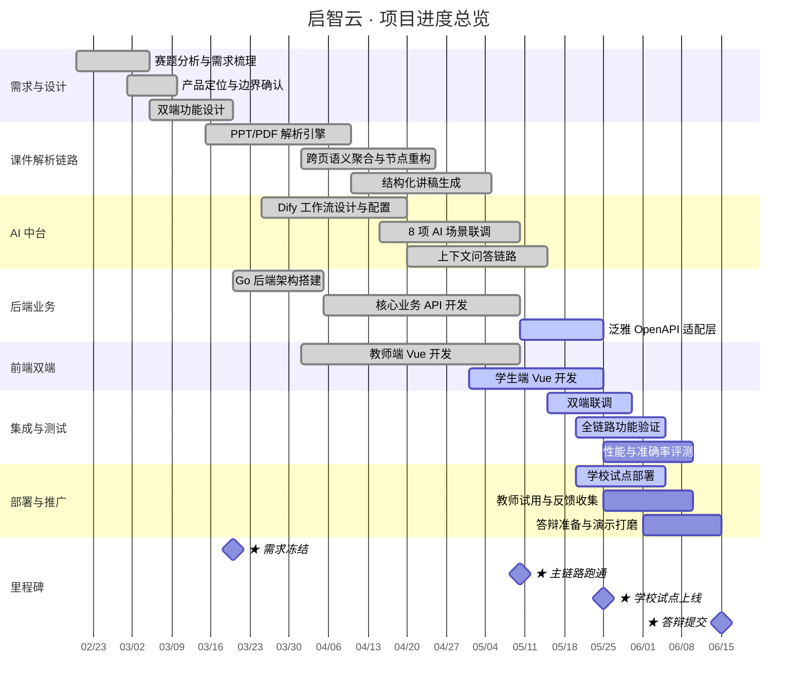
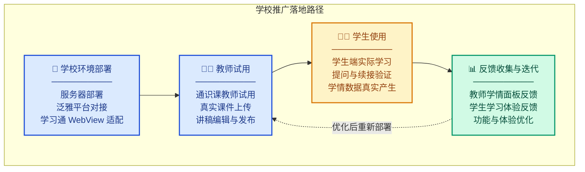

# 团队分工 · 项目进度 · 学校推广

> 用于答辩 PPT 中"团队"与"项目进展"模块，内容可直接拆页使用。

---

## 一、团队分工

### 模式：全员开发 + 各持主责方向

5 名成员全部参与核心开发，同时每人各扛一个主责方向作为责任锚点。

### 答辩口述（30 秒版）

> 我们团队共 5 人，全员参与核心开发，同时每人各持一个主责方向——队长统筹项目方向与产品定位，技术攻坚主责把关核心算法与 AI 能力，系统实现主责保障功能落地与模块联调，前端主责实现双端交互体验，交付保障主责确保全链路质量与风险管控。全员开发、各有侧重、跨域协同。

---

## 二、项目进度安排

### 甘特图

### 阶段说明

| 阶段 | 时间 | 核心产出 |
|------|------|----------|
| 需求与设计 | 2月下旬–3月中旬 | 赛题分析、产品定位、双端功能设计文档 |
| 核心开发 | 3月中旬–5月下旬 | 课件解析链路、AI 中台 8 项能力、Go 后端、Vue 双端 |
| 集成与测试 | 5月中旬–6月上旬 | 双端联调、全链路验证、性能与准确率评测 |
| 部署与推广 | 5月下旬–6月中旬 | 学校试点部署、教师试用反馈、答辩演示打磨 |

---

## 三、学校推广落地

### 核心事实

> 启智云系统目前已部署至学校真实教学环境，面向高校通识课场景进行试用推广。

### 推广路径

### 推广关键点

| 维度 | 说明 |
|------|------|
| **部署环境** | 学校服务器 + 泛雅平台对接，非演示环境 |
| **试用课程** | 高校通识课真实课件，非人造测试数据 |
| **教师参与** | 真实教师上传课件、编辑讲稿、查看学情面板 |
| **学生使用** | 真实学生学习、提问、续接，产生真实学情数据 |
| **闭环验证** | 教师根据学情反馈修改讲稿 → 学生学习更新内容 → 形成真实业务闭环 |
| **持续迭代** | 收集反馈 → 优化功能 → 重新部署，不是一次性交付 |

### 答辩口述要点

> 我们的系统不是停留在本地跑通的演示项目，而是已经部署到学校真实教学环境中。通识课教师正在使用教师端上传课件、编辑讲稿、查看学情；学生通过学生端真实学习、提问、续接。学情数据已经回传到教师端，教师根据卡点分布做出教学决策并修改讲稿——这说明我们的闭环不是设计出来的，而是真实跑通的。