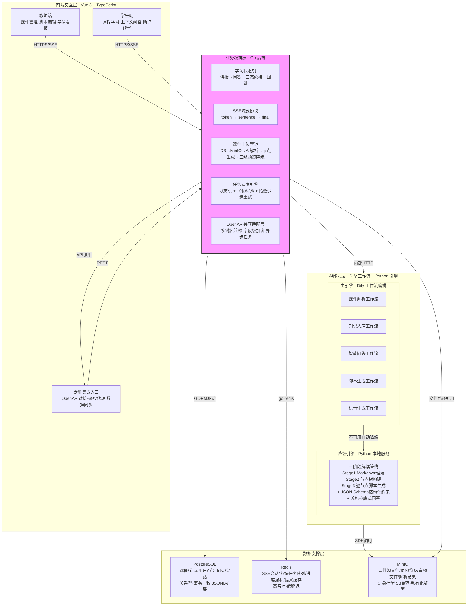

# M03 — 系统架构深度解析

> 本文档为《项目全要素备查手册》第三模块正文
> 版本：V1.0（生成中）
> 合规锚点：自查表维度三（3.1—3.6）
> 内容范围：03-01 四层架构详细拆解 → 03-02 关键设计决策 → 03-03 中间件设计 → 03-04 对外集成

---

## 03-01 四层架构详细拆解

### 架构总览

系统采用**分层编排式架构**，将业务编排与AI能力解耦为独立层级。核心原则：上层调度下层，下层不反向依赖上层；每层职责边界清晰、可独立扩展、可单独拆分验收。


│  │  + 节点引用一致性修复 + 苏格拉底式问答            │  │
│  └──────────────────────────────────────────────────┘  │
└──────────────────────┬──────────────────────────────────┘
                       │  驱动访问
                       ▼
┌─────────────────────────────────────────────────────────┐
│                    数据支撑层                            │
│  ┌──────────┐  ┌────────────────┐  ┌──────────────┐    │
│  │PostgreSQL│  │    Redis        │  │   MinIO      │    │
│  │课程/节点  │  │ 会话状态/队列   │  │ 课件源文件    │    │
│  │用户/学习  │  │ 进度游标/语义   │  │ 预览图/音频  │    │
│  │记录/会话  │  │ 缓存           │  │ 解析结果JSON │    │
│  └──────────┘  └────────────────┘  └──────────────┘    │
└─────────────────────────────────────────────────────────┘
```

### 第一层：前端交互层（Vue 3 + TypeScript）

**设计目的：** 将UI渲染与业务逻辑分离，前端只负责界面呈现与用户交互，不承担任何业务编排或AI调用职责。

**职责边界：**
- 教师端：课件上传与管理、结构化脚本编辑与确认、学情数据看板可视化
- 学生端：课程学习与播放控制、上下文问答交互、断点续学进度恢复
- 泛雅集成入口：通过OpenAPI对接泛雅平台，实现课程/用户/班级数据同步

**层间通信：**
- 向上：无（前端为最上层）
- 向下：通过HTTPS RESTful API调用编排层接口；对问答等流式场景通过SSE（Server-Sent Events）接收逐词推送内容

**关键机制：**
- 组件化双向绑定：教师端脚本编辑采用实时保存+版本对比
- 流式渲染：学生端问答采用逐词渲染，首包呈现时间控制在500ms内
- 路由懒加载：按模块拆分路由，减少初始加载体积

---

### 第二层：业务编排层（Go + Gin框架）

**设计目的：** 做状态编排与流式转发，**不承担AI推理**。AI推理延迟不可控（典型3-5秒），编排层必须保持轻量以保证毫秒级响应。

**职责边界：**
- 学习状态机：管理"讲授→遇疑→问答→三态续接→回到讲授"的完整学习流转
- SSE流式协议：采用三事件协议——逐词推送（token）、完整回答（sentence）、结构化元数据（final，含理解程度与续接位置）
- 课件上传管道：DB事务→文件存储→AI解析（主引擎+降级引擎）→节点生成→页面预览，三步降级保障
- 任务调度引擎：定时任务状态机（pending→processing→success/failed），失败自动指数退避重试
- OpenAPI兼容适配层：多键名兼容、字段级AES-256-GCM加密、泛雅平台异步任务对接

**层间通信：**
- 向下：内部HTTP调用AI能力层服务（先Dify主引擎，失败自动切本地引擎）
- 向下：通过数据库驱动访问数据层（GORM ORM操作PostgreSQL、go-redis操作Redis）
- 向上：暴露RESTful API，通过SSE协议向前端推送流式数据

**关键机制：**

*三事件SSE流式协议实现*

SSE连接建立后，编排层将AI能力层的回答拆解为三个事件按序推送：
1. **token事件**：按单词粒度逐词推送，实现流式打字机效果，首词可在500ms内到达
2. **sentence事件**：推送完整回答文本，供前端做完整渲染
3. **final事件**：推送结构化元数据——包含理解程度（none/partial/full）、续接页码、续接节点ID、续接秒数、追问建议——这些数据不混入回答文本，通过独立事件通道传输

*双引擎降级路由*

编排层内部封装统一AI能力接口，所有AI调用先尝试Dify主引擎：
- Dify正常返回 → 直接转发
- Dify返回错误或超时 → 自动向本地Python引擎发送相同请求
- 本地引擎也失败 → 返回明确的降级状态码，交由业务层做兜底处理

*任务调度状态机*

定时任务调度采用10个工作协程的并发池模式：
- 每分钟扫描到期待处理任务
- 任务进入processing状态开始执行
- 执行成功标记为success
- 执行失败自动重试（最大3次），采用指数退避策略[^1]
- 支持复习提醒、习题生成等定时业务场景

[^1]: 失败任务下次执行时间 = 当前时间 + 2^retryCount 分钟，即第1次重试间隔约2分钟，第2次约4分钟，第3次约8分钟

---

### 第三层：AI能力层（Dify工作流 + Python解析引擎）

**设计目的：** 将AI能力下沉为可复用、可编排、可降级的独立工作流，避免单点模型调用带来的耦合问题。一次解析产出，后续多场景复用。

**职责边界：**
- 课件解析工作流：上传文件 → 文本提取/多模态识别 → 结构化分页 → 校验入库
- 知识入库工作流：内容切片化 → 向量化嵌入 → 索引构建 → 知识图谱关联
- 智能问答工作流：意图识别 → 课程知识优先检索 → 上下文增强 → 苏格拉底式引导生成
- 脚本生成工作流：Markdown理解 → 节点树构建 → 逐节点脚本生成（三阶段解耦管线）
- 语音生成工作流：脚本文本 → 语音合成（TTS） → 音频文件与时长元数据输出

**层间通信：**
- 向下：通过ORM/SDK访问数据层中间件（GORM、go-redis）
- 向上：由编排层通过HTTP调用，工作流内部可实现条件路由和异常回退

**关键机制：**

*三阶段解耦管线*

脚本生成采用三阶段独立管线，每阶段有独立的JSON Schema约束[^2]：
1. **Stage1 — Markdown理解**：解析课件Markdown内容，提取关键知识点，规范化文本结构。输出：规范化Markdown + 关键点列表
2. **Stage2 — 节点树构建**：基于Stage1输出，识别教学单元边界，构建层级化知识节点树。每个节点包含node_id、title、summary、前置依赖关系（prerequisites）。输出：节点树
3. **Stage3 — 逐节点脚本生成**：基于节点树，为每个节点生成讲稿脚本。脚本内部分段（segment：开场/讲解/互动/过渡），每段标注时长估计。输出：结构化脚本数组

阶段独立可优化的含义：大模型在Stage1遗忘前文不影响Stage2的节点识别，Stage2输出有误不连累Stage3的脚本质量——每阶段可以独立调试、独立替换、独立降级。任一段失败可回退到预置模板。

*JSON Schema强制结构化输出*

为防止大模型输出格式不可控，每阶段使用`additionalProperties: false`的严格JSON Schema约束大模型输出[^3]：
- Schema不允许输出预定义字段之外的任何内容
- 输出中的node_id必须在有效范围内，不在范围内的自动映射到最近有效节点
- 节点引用破损时通过双向对齐机制修复知识图谱与脚本片段的映射关系

*VLM渐进增强*

文本提取作为默认能力始终可用，视觉多模态理解（VLM）作为可选增强特性：
- 关闭VLM：纯文本解析，系统正常运行
- 开启VLM：在文本提取基础上增加版面布局理解、图表识别、公式结构识别

*苏格拉底式问答约束*

AI问答提示词中明确禁止直接给出最终答案[^4]。回答需遵循：
- 先确认学生卡点 → 逐步引导思路 → 以问题结尾
- 回答内容绑定课件溯源页码，学生可验证答案来源

[^2]: 三阶段Schema定义参见项目`ai_engine/`模块中`build_stage1_markdown_schema`、`build_stage2_node_tree_schema`、`build_stage3_script_schema`函数
[^3]: Schema校验与节点引用修复逻辑参见`ai_engine/`模块的`normalize_stage2_nodes`、`normalize_stage3_scripts`、`align_node_segment_mapping`函数
[^4]: AI问答系统提示词与理解度判定逻辑参见`ai_engine/`模块的问答与提示词文件

---

### 第四层：数据支撑层（PostgreSQL + Redis + MinIO）

**设计目的：** 结构化数据持久化 + 高吞吐缓存加速 + 文件对象存储，三层各司其职，互不替代。

**职责边界与关键设计：**

| 中间件 | 存储内容 | 关键设计 |
|--------|---------|---------|
| PostgreSQL | 课程/教学节点/用户/学习记录/会话/知识图谱/任务调度 | 节点双字段存储（知识图谱JSON+脚本片段JSON）、字段级加密、事务一致性 |
| Redis | SSE会话状态、解析任务队列、进度游标、语义缓存 | 键空间分区设计、连接池管理、缓存失效策略 |
| MinIO | 课件源文件(PPT/PDF)、页预览图(PNG)、音频文件、解析结果JSON | SHA-256内容哈希缓存失效、分段上传支持 |

**数据模型核心：节点化内容底座**

系统中"教学节点"（TeachingNode）是贯穿所有业务链路的核心数据实体[^5]：
- 教师的脚本编辑围绕节点展开
- 学生的问答溯源定位到节点级别
- 断点续接的游标记录节点位置
- 学情统计以节点为粒度聚合
- 节点内置双重结构：知识图谱定义（前置依赖、难度系数）与脚本片段映射（一段文本可跨节点复用）

这种"以节点为中心"的设计确保：课件解析、AI问答、断点续接、学情统计四套业务逻辑共用同一套数据结构，不存在概念对齐问题。

[^5]: TeachingNode数据模型定义参见`backend/`模块中模型定义文件，包含知识图谱字段与脚本片段字段的双重结构

---

## 03-02 关键设计决策全解

系统架构中的每一个分层选择，都是在开发过程中面对真实工程约束做出的决策。以下四个决策共同支撑了系统的韧性、可扩展性和教学一致性。

---

### 决策一：编排与能力分离

**问题：** AI推理延迟不可控（典型3-5秒），如果业务编排层也承担AI推理任务，那么编排层整体的响应延迟将被拖慢到秒级。同时，编排层需要保持无状态以支持水平扩展，而AI推理通常需要GPU资源，两者部署在同一进程内会导致资源争抢和扩缩容冲突。

**决策：** 业务编排层（Go后端）只做状态管理和流式转发，AI推理全部下沉至AI能力层（Dify工作流/Python引擎）。两层之间通过HTTP接口调用，而非代码内嵌。

**落地实现：**
- 编排层实现统一AI能力接口，所有AI调用面向接口编程，不依赖具体引擎实现
- SSE流式转发由编排层负责——编排层是"管道"而非"水源"，只管数据流向不管数据生产
- 编排层自身无状态，可多实例水平扩展应对并发

**容错保障：**
- 编排层不依赖AI能力层的实时响应——SSE天然容忍延迟波动，AI推理慢只影响单次回答耗时，不阻塞编排层其他请求
- 编排层单实例故障不影响其他实例，前端通过负载均衡切换

---

### 决策二：能力可降级

**问题：** Dify作为工作流编排引擎是AI能力层的核心依赖。Dify一旦宕机或网络异常，整个AI能力层将不可用。教学场景对系统可用性要求高——课堂不能因为引擎故障而中断。

**决策：** 采用双引擎注册机制，Dify为主引擎、本地Python引擎为降级引擎。编排层先尝试Dify，失败后自动切换。

**落地实现：**
- 编排层内部统一AI调用入口：先构造请求发往Dify → 检查响应状态 → 成功直接返回 → 失败或异常自动向本机Python引擎（127.0.0.1:8000）发送相同请求[^6]
- 本地Python引擎实现了完整的AI功能子集：课件解析、知识入库、智能问答、脚本生成、语音合成
- 切换过程对前端完全透明——编排层统一封装降级逻辑，上层无感知

**容错保障：**
- Dify恢复后自动切回主引擎（下次请求从主引擎开始）
- 本地引擎与Dify保持相同的接口规范，确保请求/响应格式完全兼容
- 降级切换仅在编排层日志中记录，不中断用户操作

[^6]: 双引擎降级路由具体实现参见`backend/`模块中AI客户端实现文件

---

### 决策三：节点化统一语言

**问题：** 传统课件方案以"页"为最小操作单元。但"页"的粒度太粗——编辑讲稿无法精确到页内段落、问答溯源无法定位到页内位置、续接恢复无法跨越页边界。如果脚本编辑、问答溯源、续接定位、学情统计各用一套粒度标准，四条业务链路永远无法对齐。

**决策：** 定义"教学节点"为系统最小语义单元。页不是最小单位，教学节点才是。所有业务链路围绕节点展开。

**落地实现：**
- 每页课件被解析为1到多个教学节点（TeachingNode），每个节点代表一个独立的教学片段（如一个知识点、一个案例、一个互动环节等）
- 每个节点包含双重结构：知识图谱定义（前置依赖、难度系数、关联关系） + 脚本片段映射（讲授脚本段落可跨节点复用）
- 所有业务链路基于节点展开：脚本编辑以节点为粒度 → 问答溯源定位到节点 → 续接游标指向节点 → 学情直方图按节点统计

**容错保障：**
- 节点引用破损时自动修复：双向对齐知识图谱与脚本片段映射，确保每个脚本段落至少挂载到一个有效节点[^7]
- 孤立节点引用自动监测：跨11张数据表扫描无效引用，标记后由运维脚本统一清理[^8]

[^7]: 节点引用双向对齐逻辑参见`ai_engine/`模块中的映射对齐函数
[^8]: 孤立节点引用监测参见`backend/`模块中的知识图谱扫描实现

---

### 决策四：课程知识优先

**问题：** 通用大模型直接回答学生问题容易产生脱离教材内容的"幻觉"答案。教学场景要求每个回答都必须可溯源、有依据，不能变成开放域聊天。

**决策：** 问答时优先检索当前课程的知识内容，大模型基于检索结果生成回答，而非让模型"自由发挥"。回答绑定溯源页码。

**落地实现：**
- 课件解析后自动构建课程专属知识库（内容切片化 → 向量化 → 索引构建）
- 问答时采用三级级联上下文构建：**目标节点脚本优先 → 当前页内容补充 → 全页教学节点拼接兜底**[^9]
  - 第一级：只提取当前问答对应节点的脚本段落（精确聚焦）
  - 第二级：如果节点内容不足以回答问题，扩大到当前页全部教学节点
  - 第三级：仍然不足时，取全页CoursePage文本拼接
- 大模型基于构建好的上下文生成回答，回答内容必须绑定课件来源页码

**容错保障：**
- LLM不可用时自动降级到关键词匹配理解度判定（中文教育常用重教词汇集）[^10]
- 理解程度判定采用双重策略：LLM综合语义分析优先，接口故障时切换到规则匹配

[^9]: 三级级联上下文构建逻辑参见`backend/`模块中对话支持文件
[^10]: 理解程度判定降级策略参见`ai_engine/`模块中的问答实现

---

## 03-03 中间件部署设计

### PostgreSQL

**选型理由：** 项目核心数据（课程、教学节点、用户、学习记录、会话、知识图谱）具有复杂关联关系，要求事务级强一致性。PostgreSQL的JSONB字段类型适配半结构化教学数据存储。

**关键设计：**
- 教学节点表采用双JSON字段存储——知识图谱定义与脚本片段映射，兼顾结构化查询与灵活扩展
- 字段级AES-256-GCM加密用于敏感数据（如用户认证信息）

### Redis

**选型理由：** SSE会话状态、任务队列、进度游标等场景要求高吞吐低延迟。Redis的多种数据结构适配不同场景（字符串用于缓存、列表用于队列、哈希用于会话）。

**关键设计：**
- SSE会话状态暂存于Redis，支持会话过程中断后恢复
- 解析任务队列利用Redis列表实现异步处理
- 语义缓存减少重复内容向AI引擎的请求

### MinIO

**选型理由：** 课件源文件（PPT/PDF）、预览图（PNG/JPEG）、音频文件（MP3）需要对象存储。MinIO兼容S3 API，适合私有化部署。

**关键设计：**
- 内容哈希缓存失效：音频文件使用源脚本SHA-256哈希作为缓存键，脚本内容变化时自动失效重新生成
- 课件上传管道中预先将源文件存入MinIO，后续AI解析、预览图生成均基于MinIO存储路径操作

---

## 03-04 对外集成架构

### 集成方式

系统通过RESTful OpenAPI实现与泛雅平台的标准化对接，覆盖：
- 课程同步：泛雅平台课程数据一键同步至系统
- 用户同步：校园用户身份数据双向同步
- 班级管理：教学班级创建、选课关系维护
- 课件解析：泛雅平台课件通过OpenAPI提交解析

### 鉴权与安全

- 接口鉴权通过Token机制实现，配合请求签名校验
- 敏感数据在传输和存储层面双重防护：传输层使用HTTPS，存储层对关键字段采用AES-256-GCM加密
- 键名兼容设计：支持泛雅平台原有键名格式，降低平台对接改造成本

### 异常处理策略

- 超时重试：API调用设置超时阈值，超时后自动重试
- 异步任务回调：耗时操作（如课件解析）采用异步模式，完成后再回调通知
- 错误码分级：明确区分客户端错误（参数校验不通过）、服务端错误（引擎不可用）、业务异常（课件格式不支持）

---

> 版本：V1.0（初稿完成）
> 状态：已包含四层架构详细拆解（含中间件拓扑展开）、四个关键设计决策全解、中间件设计、对外集成架构
