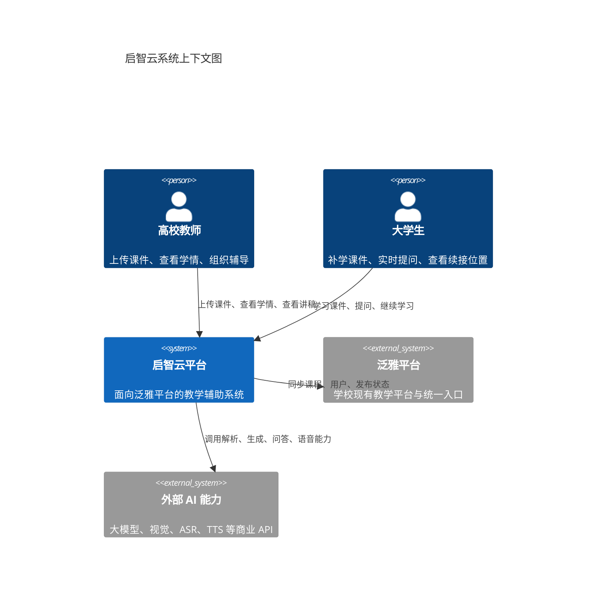
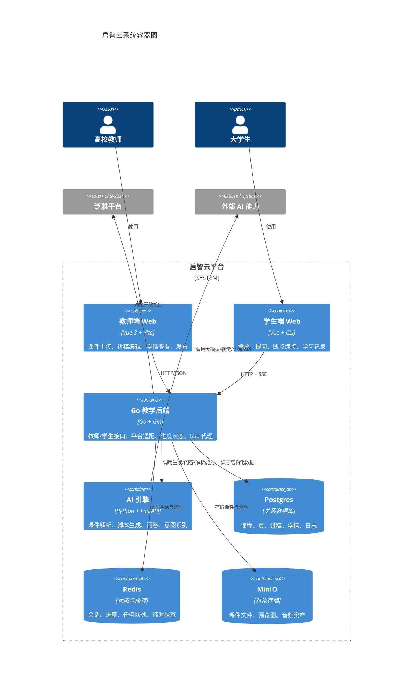

# 启智云企业级 C4 架构说明

> 这份文档的目标，不是把系统画得“层次很多”，而是把系统画得“可协作、可治理、可演进”。
>
> 架构的核心不是分层，而是围绕**教学闭环**做出一组长期难改的决策：课件如何结构化、讲授如何续接、问答如何上下文感知、学情如何沉淀、平台如何统一接入。

---

## 一、为什么要用 C4

对于启智云来说，C4 比通用分层图更合适，原因很简单：

- **上下文图**能先讲清楚系统边界，明确教师、学生、泛雅平台、外部 AI 能力分别是什么角色。
- **容器图**能讲清楚可独立演进的运行单元，说明哪些能力在前端、哪些在后端、哪些在 AI 引擎、哪些在基础设施。
- **组件图**能讲清楚每个容器内部谁负责什么，避免“后端一坨业务”的假专业。
- **ADR**能讲清楚为什么这么拆，而不是只告诉别人“我们拆了”。

这比“接入层-业务层-数据层”的分层图更有说服力，因为它回答的是：

> 这个系统到底为了什么而存在，它的边界在哪里，它靠什么演进。

---

## 二、这个系统真正要解决什么问题

启智云不是在做一个单纯的 AI 问答工具，而是在做一个面向泛雅平台的教学辅助闭环。

它要同时解决三类问题：

1. **教师侧**：教师需要快速看见学情、卡点和薄弱点，决定补讲和辅导策略。
2. **学生侧**：学生在缺课、错题、卡点场景里需要连续学习，问完之后还能续接原来的进度。
3. **平台侧**：泛雅需要的是一套可嵌入、可签名、可验证、可扩展的标准化能力，而不是一个孤立 Demo。

因此，这个系统的架构边界天然不是“前后端”，而是：

- 课件域
- 讲授域
- 问答域
- 学情域
- 平台接入域

---

## 三、C4 L1：系统上下文图

### 这一层要表达的不是技术，而是边界

- 教师和学生是系统的直接使用者。
- 泛雅平台是系统的业务宿主。
- 外部 AI 能力是系统可替换的能力来源，不是系统本身。

如果上下文图都讲不清楚，就说明你还没讲明白这个项目到底服务谁。

---

## 四、C4 L2：容器图

> 说明：当前仓库还不是完全拆成多个微服务的形态，所以这里按“可独立演进的职责边界”来画容器，而不是按物理进程硬拆。

### 这张图要表达的关键点

1. **教师端和学生端不是同一个页面换个入口**，而是两个控制目标不同的容器。
2. **Go 后端不是一堆 Controller**，而是承载教学编排、平台适配和状态管理的中枢。
3. **AI 引擎不是系统中心**，而是给课件解析、讲稿生成和问答提供能力的执行器。
4. **Postgres / Redis / MinIO 各有边界**：
   - Postgres 存结构化事实
   - Redis 存短期状态和进度
   - MinIO 存文件与音频资产

这张图最重要的价值在于：任何新需求都可以先问一句“它属于哪个容器”，而不是让所有人都去改同一坨代码。

---

## 五、C4 L3：组件图

### 5.1 Go 教学后端内部组件

Go 后端是整个系统的协同中枢，内部建议按下面的组件边界理解：

| 组件 | 职责 | 典型代码位置 |
|---|---|---|
| API Router / Gateway | 路由、鉴权、限流、统一响应 | `backend/internal/router/*`、`backend/api/main.go` |
| 教师编排组件 | 上传、脚本、发布、学情、卡点、提问记录 | `backend/internal/handler/teacher.go`、`backend/internal/handler/compat_teacher.go` |
| 学生交互组件 | 学习会话、播放、SSE 问答、断点恢复 | `backend/internal/handler/student.go`、`backend/internal/handler/compat_student.go` |
| OpenAPI 适配组件 | 泛雅签名、路径、响应格式映射 | `backend/internal/handler/compat_openapi.go`、`backend/internal/handler/platform_v1.go` |
| 音频资产组件 | 生成音频元数据、播放时间轴、fallback 逻辑 | `backend/internal/handler/audio_support.go` |
| 学情/对话组件 | 记录问题、对话、理解程度、续接位置 | `backend/internal/handler/dialogue_support.go` |
| AI Client 适配器 | 封装调用 AI 引擎的 HTTP 客户端 | `backend/internal/service/ai_engine_client.go` |
| Repository / Model 层 | 持久化与领域模型 | `backend/internal/model/*`、`backend/internal/repository/*` |

#### 这里真正体现架构思维的地方

- **教师编排组件**负责“老师看到什么、保存什么、发布什么”，不负责算法。
- **学生交互组件**负责“学生怎么问、怎么播、怎么续接”，不负责学情统计的最终定义。
- **OpenAPI 适配组件**是边界层，它的存在是为了让内部能力能稳定接入泛雅，而不是让业务代码到处散落签名逻辑。
- **AI Client 适配器**隔离大模型变化，保证核心业务逻辑不直接依赖具体模型厂商。

### 5.2 AI 引擎内部组件

| 组件 | 职责 | 典型代码位置 |
|---|---|---|
| Parser | PDF / PPTX 解析、视觉描述、多模态结构化输出 | `ai_engine/parser.py` |
| Generator | 讲稿、节点、导图、增强脚本生成 | `ai_engine/generator.py` |
| QAResponder | 上下文问答、理解程度判断、续接策略 | `ai_engine/qa.py` |
| Schema Layer | 统一数据协议、字段归一、节点/段落规范 | `ai_engine/schema.py` |
| CLI / Health | 本地验收、脚本测试、调试入口 | `ai_engine/generate.py`、`ai_engine/main.py` |

#### 这里的关键设计

- Parser 不只是“抽文本”，而是把课件转成能进入教学流程的数据结构。
- Generator 不只是“写一段话”，而是生成可以被播放、编辑、续接的结构化讲授内容。
- QAResponder 不只是“回答问题”，而是把问题变成“继续/补讲/重讲”的教学决策。

---

## 六、三个最重要的架构决策（ADR 思维）

> 如果评委问“你为什么这么设计”，不要说“因为这样好看”，要直接说决策、理由和后果。

### ADR-001：节点化模型作为全系统统一语言

**上下文**

- 课件是页级的，但教学和问答是知识点级的。
- 如果只按页组织，续接会粗糙，问答也无法精确定位。

**决策**

- 用 `node_id`、`segment_id`、`resume_node_id` 作为贯穿教师端、学生端和 AI 引擎的统一语言。

**理由**

- 节点化模型是教学闭环中最稳定的边界。
- 页面可以变，知识点边界不应该随页面轻易漂移。

**后果**

- 教师编辑、学生播放、AI 问答和学情统计可以对齐到同一知识单元。

### ADR-002：AI 作为适配层，而不是架构中心

**上下文**

- 课件解析、讲稿生成、问答、语音合成都依赖外部 AI 能力。
- 这些能力会变模型、变供应商、变费用策略。

**决策**

- 把所有模型调用统一包进 AI 引擎和 Go 侧 AI Client 适配器，不让核心业务直接依赖模型厂商。

**理由**

- 这样切换模型时，改动局限在适配器层。

**后果**

- 核心教学逻辑可以长期稳定，模型可以替换。

### ADR-003：问答必须支持 SSE 和续接

**上下文**

- 教学场景不是一次性问答，而是“问完还要继续学”。
- 如果没有流式输出，用户感知延迟会明显变差。

**决策**

- 学生问答采用 SSE 流式返回，最终事件携带 `need_reteach`、`understanding_level`、`resume_page`、`resume_node_id`、`resume_sec`。

**理由**

- 流式体验更符合教学交互。
- 续接字段让问答真正嵌入学习过程。

**后果**

- 问答不是终点，而是讲授继续的控制信号。

### ADR-004：开放接口和内部接口分离

**上下文**

- 泛雅平台有签名、固定路径和统一响应格式要求。
- 内部前端需要的是更贴近业务的接口。

**决策**

- 内部使用产品 API，外部暴露 OpenAPI Adapter 层。

**理由**

- 避免内部业务逻辑被外部规范绑死。
- 也避免外部对接时改坏内部接口。

**后果**

- 同一套核心能力可以同时服务前端和平台接入。

---

## 七、把 C4 和当前仓库一一对应

### L1 对应

- 教师 / 学生 / 泛雅平台 / 外部 AI 能力

### L2 对应

- [frontend/teacher](../frontend/teacher)
- [frontend/student](../frontend/student)
- [backend](../backend)
- [ai_engine](../ai_engine)
- Postgres / Redis / MinIO（由 `docker-compose.yml` 提供）

### L3 对应

- [backend/internal/handler/teacher.go](../backend/internal/handler/teacher.go)
- [backend/internal/handler/compat_student.go](../backend/internal/handler/compat_student.go)
- [backend/internal/handler/compat_openapi.go](../backend/internal/handler/compat_openapi.go)
- [backend/internal/handler/audio_support.go](../backend/internal/handler/audio_support.go)
- [backend/internal/handler/dialogue_support.go](../backend/internal/handler/dialogue_support.go)
- [ai_engine/parser.py](../ai_engine/parser.py)
- [ai_engine/generator.py](../ai_engine/generator.py)
- [ai_engine/qa.py](../ai_engine/qa.py)

### 仍然建议统一口径的文档

- [docs/当前运行接口清单.md](当前运行接口清单.md)
- [docs/API_DESIGN_V2.md](API_DESIGN_V2.md)
- [docs/系统架构说明.md](系统架构说明.md)

---

## 八、为什么这比通用分层图更能体现“懂”

因为它回答了三个评委真正关心的问题：

### 1. 你的系统在解决什么

- 答案不是“做一个 AI 系统”，而是“让静态课件变成可交互、可续接、可统计的教学闭环”。

### 2. 你的系统边界在哪里

- 教学内容、问答、学情、平台接入，各自有边界，不混成一锅。

### 3. 你的系统怎么演进

- 模型可以替换，平台可以对接，数据可以沉淀，但节点化语言和教学闭环不变。

这就是企业级 C4 架构的真正价值：它不是为了“图好看”，而是为了让团队、评委和未来维护者都能一眼理解系统。

---

## 九、答辩时可以直接用的一句话

> 我们没有把系统画成一个通用的分层图，而是按 C4 模型把启智云拆成上下文、容器和组件三层：外层明确系统边界，中层明确可独立演进的运行单元，内层明确教学编排、问答、学情和平台接入的职责边界。这样做的目的，是让架构真正服务于“课件结构化、上下文问答、学习续接和学情闭环”这四个核心问题。
