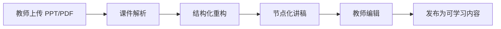
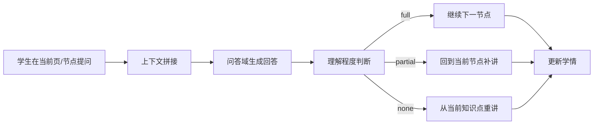
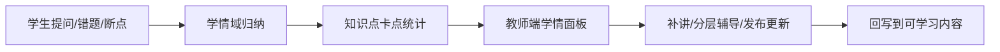

# 架构重构设计：为“教学闭环”而不是为“软件分层”而设计

> 这份文档不是在重复“接入层、业务层、数据层”这种所有系统都能套的模板，而是回答一个更关键的问题：
> **为什么这个项目必须被设计成现在这个样子，它到底是为了解决什么问题而专门提出的一整套思路。**

---

## 一、先说结论：这个项目的架构，本质上是在解决什么

这个项目要解决的核心问题，不是“做一个 AI 问答功能”，也不是“做一个课件播放器”，而是：

> **把静态课件变成可交互、可续接、可统计、可迭代的教学过程。**

如果再具体一点，它要同时解决三类现实问题：

1. **教师侧问题**：教师无法快速知道学生学得怎么样，哪里需要补讲，哪里需要分层辅导。
2. **学生侧问题**：学生在缺课、错题、卡点场景里很难连续学习，问完之后容易断掉。
3. **平台侧问题**：泛雅需要一套可嵌入、可签名、可扩展、可验证的能力，而不是一个孤立 Demo。

所以，这个项目的架构不是围绕“技术分层”来组织的，而是围绕“教学闭环”来组织的。

---

## 二、什么才算这个项目的“架构”

对于这个项目来说，架构不是按钮怎么摆、接口怎么命名、代码怎么分文件，而是以下四类最难改的决策集合：

### 1. 系统到底要围绕什么问题组织

这里的答案不是“围绕 AI 能力”，而是“围绕教学闭环”：

- 课件如何变成可讲授内容
- 学生如何在课程中提问并继续学
- 教师如何看到学情并做补讲
- 平台如何把这些能力统一接入并验证

### 2. 系统到底要按什么业务边界拆分

这里的边界不是“前后端”这种通用边界，而是：

- 课件域：负责把 PPT/PDF 变成结构化学习材料
- 讲授域：负责把材料变成能讲、能播、能续接的内容
- 问答域：负责把学生问题和当前上下文绑定起来
- 学情域：负责把问题、卡点、错题和掌握度沉淀下来
- 平台接入域：负责把内部能力对齐到泛雅接口规范

### 3. 系统到底要让谁拥有控制权

这里的答案是：

- 教师拥有“教学内容控制权”
- 学生拥有“学习节奏控制权”
- 平台拥有“接入与分发控制权”

### 4. 哪些东西是可替换的，哪些东西是不能轻易替换的

- 可替换：LLM、视觉模型、TTS、ASR、向量检索实现
- 不可轻易替换：课件节点化模型、上下文续接链路、学情沉淀模型、平台适配协议

这就是这个项目真正的架构边界。

---

## 三、为什么必须这样架构

如果不按“教学闭环”来设计，系统会很快退化成三个互不理解的孤岛：

1. 教师端变成一个单纯的上传和编辑页面。
2. 学生端变成一个单纯的聊天窗口或播放器。
3. 后端变成一堆接口拼接和字段透传。

这样的问题在答辩里最容易暴露：评委会问你“你这个系统和普通分层软件有什么区别”，你只能回答“我们有 AI”。这不够。

这个项目必须用架构把下面三件事强行锁在一起：

- **结构化课件**：没有结构，就没有可续接。
- **上下文问答**：没有上下文，就没有准确答疑。
- **学情反馈**：没有反馈，就没有教学闭环。

所以，架构的目的不是让代码“看起来整齐”，而是让系统“长期还能长大而不烂”。

---

## 四、核心问题驱动下的架构设计

### 4.1 核心问题一：静态课件为什么不好学

静态课件的问题不是“文件格式不好”，而是它只提供内容，没有提供学习路径。

因此，系统必须把课件从“文件”升级成“学习结构”。

这带来一个必然的架构决策：

> **必须先做课件结构化，再做讲授、问答和学情。**

也就是说，课件解析不是前置装饰，而是整个系统的地基。

### 4.2 核心问题二：学生为什么问完还要能继续学

普通问答系统只回答问题，不恢复学习位置。

而这个项目的目标是：

> **问答是教学过程的一部分，不是教学过程的终点。**

因此，系统必须有“续接”能力：

- 续接到哪一页
- 续接到哪个节点
- 续接到哪一秒

这意味着问答域和讲授域不能分离成两个毫不相干的功能页，它们必须共享同一套节点化上下文模型。

### 4.3 核心问题三：教师为什么需要学情，而不是只看结果

教师真正需要的不是“这个学生答对了还是答错了”，而是：

- 哪些知识点是全班共性问题
- 哪些学生只是部分理解
- 哪些地方应该补讲，哪些地方应该分层辅导

所以学情域不能只是统计日志，它必须从一开始就和知识节点、问题记录、播放进度绑定在一起。

---

## 五、这套系统应该如何拆：五个核心领域

这不是通用分层图，而是围绕问题拆出的领域边界。

### 5.1 课件域

**职责**

- 接收课件上传
- 解析 PPT/PDF
- 把原始课件转成页级、节点级结构化材料
- 维护课件元数据与预览

**它要解决的问题**

- 课件不是可讲授内容，必须先结构化

**当前代码映射**

- [ai_engine/parser.py](../ai_engine/parser.py)
- [backend/internal/service/course.go](../backend/internal/service/course.go)
- [backend/internal/handler/course.go](../backend/internal/handler/course.go)

### 5.2 讲授域

**职责**

- 根据结构化课件生成讲稿
- 将讲稿拆成节点和段落
- 生成音频元数据与播放时间轴
- 支持教师编辑后再发布

**它要解决的问题**

- 课件解析完不等于能讲，必须变成可播、可改、可续接的讲授材料

**当前代码映射**

- [ai_engine/generator.py](../ai_engine/generator.py)
- [ai_engine/main.py](../ai_engine/main.py)
- [backend/internal/handler/teacher.go](../backend/internal/handler/teacher.go)
- [backend/internal/handler/audio_support.go](../backend/internal/handler/audio_support.go)

### 5.3 问答域

**职责**

- 接收学生问题
- 拼接当前页、当前节点、历史上下文
- 生成答案并给出来源
- 判断是否需要重讲或补讲

**它要解决的问题**

- 问答不是聊天，而是和当前学习节点强绑定的教学交互

**当前代码映射**

- [ai_engine/qa.py](../ai_engine/qa.py)
- [backend/internal/handler/compat_student.go](../backend/internal/handler/compat_student.go)
- [backend/internal/handler/compat_openapi.go](../backend/internal/handler/compat_openapi.go)

### 5.4 学情域

**职责**

- 记录提问、错题、笔记、播放进度、理解程度
- 计算知识点卡点、薄弱点和掌握状态
- 给教师端提供班级学情视图

**它要解决的问题**

- 没有学情沉淀，就无法形成教学闭环

**当前代码映射**

- [backend/internal/handler/dialogue_support.go](../backend/internal/handler/dialogue_support.go)
- [backend/internal/handler/compat_student.go](../backend/internal/handler/compat_student.go)
- [backend/internal/handler/teacher.go](../backend/internal/handler/teacher.go)

### 5.5 平台接入域

**职责**

- 对齐泛雅开放 API
- 处理签名、路径、响应格式和兼容字段
- 把内部教学能力包装成外部可调用接口

**它要解决的问题**

- 核心能力要能被平台安全接入，而不是只存在于本地页面中

**当前代码映射**

- [backend/internal/handler/compat_openapi.go](../backend/internal/handler/compat_openapi.go)
- [backend/internal/handler/platform_v1.go](../backend/internal/handler/platform_v1.go)
- [docs/API_DESIGN_V2.md](API_DESIGN_V2.md)

---

## 六、核心流程：这个系统最重要的三条流

### 6.1 流一：课件变成可讲授内容

**为什么这条流必须单独存在**

- 因为“文件”不能直接支撑教学
- 因为教师需要可编辑，而不是一锤子生成
- 因为后续问答和续接都依赖同一套节点结构

### 6.2 流二：学生提问后还能继续学

**为什么这条流必须单独存在**

- 因为问答不是一个终点，而是学习过程的一部分
- 因为学生问完后必须回到原来的学习位置
- 因为教师要看到这些提问如何反映学情

### 6.3 流三：教师看到学情后做补讲和辅导

**为什么这条流必须单独存在**

- 因为教师真正关心的是“全班哪里没学会”
- 因为补讲和辅导必须基于真实卡点，而不是凭感觉
- 因为平台最终要形成教学迭代闭环

---

## 七、这套架构的关键决策是什么

### 7.1 先结构化课件，再做 AI 能力

这个决定解决的是：

- AI 不能直接面对一堆无结构课件
- 没有结构，问答和续接都无法稳定

### 7.2 让节点成为统一语言

节点是贯穿整个系统的统一媒介：

- 教师编辑节点
- 学生播放节点
- 问答引用节点
- 学情统计节点

这个决定解决的是：

- 页面不是知识边界，节点才是
- 只有节点统一，问答、播放和统计才能对齐

### 7.3 AI 是能力适配器，不是独立架构中心

LLM、视觉模型、ASR、TTS 都很重要，但它们是可替换能力，不是系统灵魂。

真正不能替换的是：

- 节点化课件模型
- 上下文续接策略
- 学情沉淀模型
- 泛雅适配协议

### 7.4 教师和学生不是一套页面两个按钮，而是两种控制权

- 教师控制教学内容和学情反馈
- 学生控制学习节奏和提问时机

这决定了系统必须拆成两个前端、两个视角、两条主流程。

---

## 八、如果要验证这个架构好不好，应该问什么

不是问“你画得漂不漂亮”，而是问这三个问题：

### 1. 你解决的是什么具体问题

- 如果答案只是“我们用了 AI”，那不是架构
- 如果答案是“我们把静态课件变成可续接的学习过程”，才是架构

### 2. 如果我要新增一个功能，你要改哪里

- 新增错题本，应该主要改学情域
- 新增语音讲授，应该主要改讲授域和能力适配器
- 新增平台同步，应该主要改平台接入域

如果每次都要改一大片，那说明架构边界不对。

### 3. 如果我要换一个大模型，你要改哪里

- 只改 AI 适配器，不改核心领域逻辑

如果一换模型，整个系统重写，说明你没有真正的架构隔离。

---

## 九、把这套架构落回当前仓库

如果把这个设计映射到当前仓库，可以这样理解：

- **课件域**：`ai_engine/parser.py` + `backend/internal/service/course.go`
- **讲授域**：`ai_engine/generator.py` + `backend/internal/handler/teacher.go` + `backend/internal/handler/audio_support.go`
- **问答域**：`ai_engine/qa.py` + `backend/internal/handler/compat_student.go`
- **学情域**：`backend/internal/handler/dialogue_support.go` + `backend/internal/handler/teacher.go`
- **平台接入域**：`backend/internal/handler/compat_openapi.go` + `backend/internal/handler/platform_v1.go`

这说明当前仓库不是“一个通用分层项目”，而是已经具备一套围绕教学闭环组织出来的真实领域结构。

---

## 十、最后一句话

这个项目真正的架构，不是“前端、后端、AI、数据库”四层，而是：

> **围绕课件结构化、节点化讲授、上下文问答、学情反馈和平台接入，专门设计的一整套教学闭环系统。**

如果把项目名称换成电商、OA 或外卖，这套架构就不成立；这正说明它不是通用模板，而是真正为这个问题定制出来的架构。
