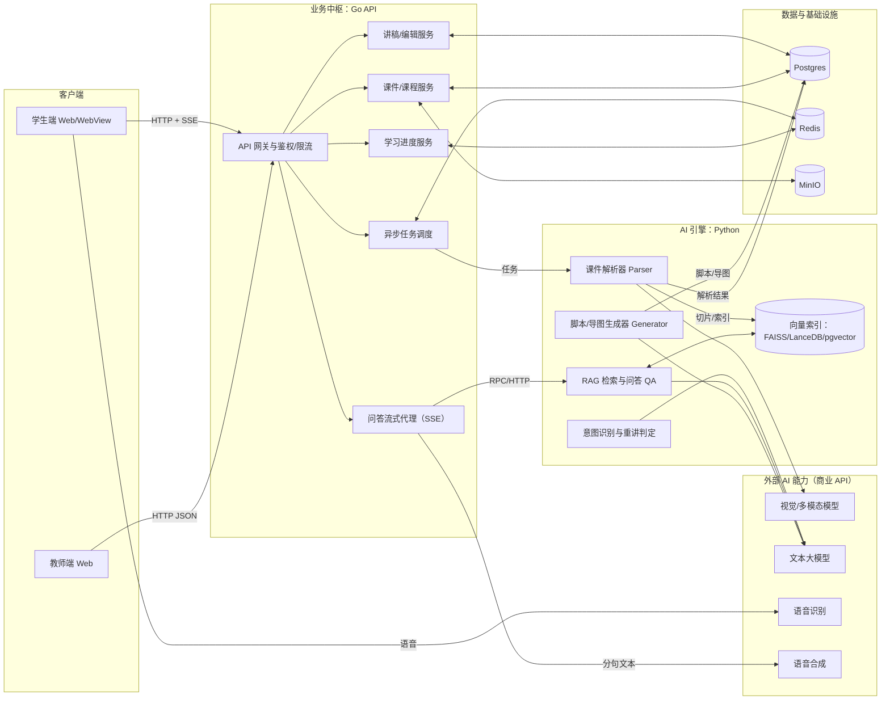
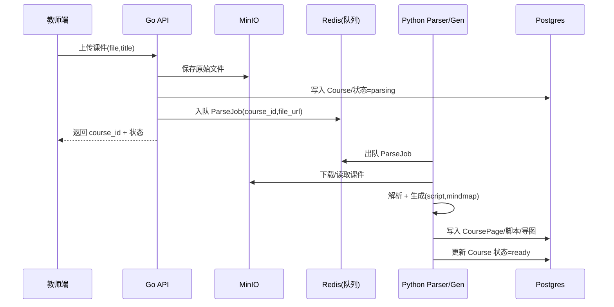
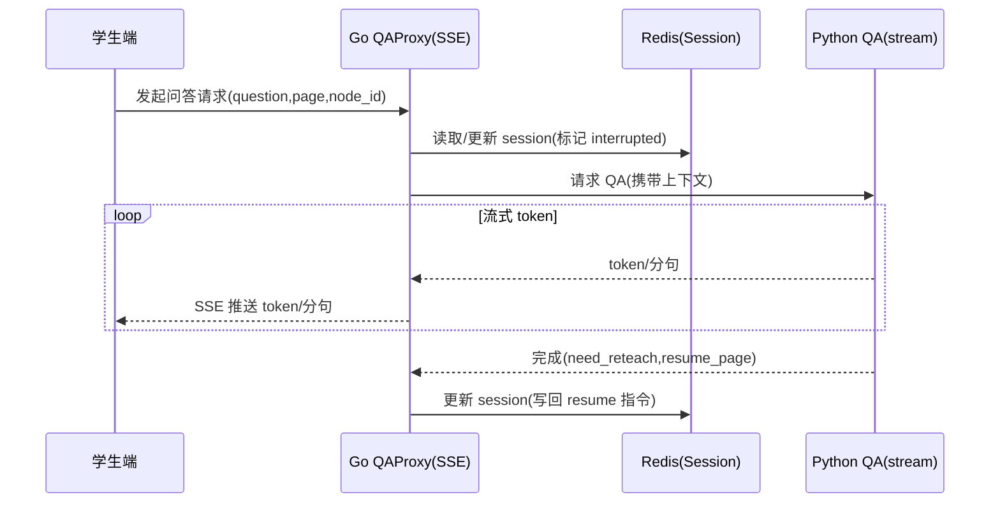

# 泛雅 AI 互动智课系统：系统架构说明

## 1. 一句话目标与硬约束

### 1.1 一句话目标
将教师上传的 PPT/PDF 自动解析为结构化“可讲授脚本”，支持学生端在讲授过程中**文字/语音打断提问**，AI 结合课件上下文进行高相关回答，并在问答结束后**智能续接讲授进度**。

### 1.2 硬约束（必须遵守）
- **算力约束**：服务器 8C16G，禁止在服务器本地常驻加载大语言模型（LLM）/大规模多模态模型；LLM/Vision/ASR/TTS 以外部商业 API 为主。
- **时延指标**：问答响应（体感）≤ 5 秒；因此学生端问答必须支持**流式输出**（SSE 优先）。
- **解析指标**：课件解析 ≤ 2 分钟/份（异步任务）；知识点识别 ≥ 80%；答案准确率 ≥ 85%。
- **集成形态**：可嵌入泛雅 Web / 学习通 WebView；接口支持异步调用集成。

---

## 2. 仓库结构与职责映射（读代码前先读这节）

- Go 业务后端：`cmd/api`、`internal/*`、`pkg/*`
- Python AI 引擎：`ai_engine/*`
- 学生端前端：`ai-vue-frontend/*`（Vite + Vue）
- 教师端前端：`teacher-frontend/*`（Vite + Vue）
- 基础设施：`docker-compose.yml`（Postgres、Redis、MinIO）
- 教师端接口说明：`API_DESIGN_V2.md`

### 2.1 架构方块 ↔ 代码位置速查

| 架构方块 | 主要代码位置 | 说明 |
|---|---|---|
| Go API 启动与路由 | `cmd/api/main.go` | Gin 路由注册、DB/Redis/MinIO 初始化 |
| 教师端接口 Handler | `internal/handler/*` | 课件管理、讲稿编辑、学情与提问记录 |
| 业务 Service | `internal/service/*` | 课件上传/存储编排、后续可扩展 QA/进度服务 |
| Redis 访问与状态机 | `internal/repository/redis.go` | Session、队列、缓存（规划） |
| DB 模型 | `internal/model/*` | Course/CoursePage/UserProgress/QuestionLog 等 |
| 对象存储 | `pkg/oss/minio.go`、`oss/minio.go` | MinIO 客户端封装与配置 |
| AI 解析/生成/问答 | `ai_engine/parser.py`、`ai_engine/generate.py`、`ai_engine/qa.py` | 统一 schema、讲稿/导图、问答溯源 |
| AI 本地验收 | `ai_engine/debug_harness.py` | 一键生成样例并输出 debug_output |
| 教师端前端 | `teacher-frontend/src/*` | 上传、列表、讲稿编辑等 |
| 学生端前端 | `ai-vue-frontend/src/*` | 播放、打断提问、SSE 展示与续接 |

---

## 3. 逻辑架构总览

### 3.1 架构图（逻辑）



### 3.2 架构图“每个方块”的说明（逐一对照）

| 方块 | 归属 | 输入 | 输出 | 职责边界 |
|---|---|---|---|---|
| 教师端 Web | 前端 | 教师操作、课件文件 | 课件列表、讲稿编辑、发布 | 只负责 UI/交互，不做解析/问答逻辑 |
| 学生端 Web/WebView | 前端 | 学生播放与提问 | 字幕/音频播放、进度可视化 | 维护本地播放游标，配合后端续接 |
| API 网关与鉴权/限流 | Go | 所有客户端请求 | 统一响应 | Token/权限/限流/日志，不承载业务规则 |
| 课件/课程服务 | Go | 上传/删除/发布/预览 | Course、Page、文件 URL | 管理课件元数据、文件存储、页预览 |
| 讲稿/编辑服务 | Go | 获取/保存讲稿 | 页级脚本 | 提供教师可编辑的脚本持久化 |
| 学习进度服务 | Go | 学生播放与问答事件 | 进度游标、统计 | Redis 状态机：页码/节点/中断状态 |
| 问答流式代理（SSE） | Go | 学生问题 | SSE 流（token/分句） | 对前端保持 SSE；对 AI 引擎转发/聚合 |
| 异步任务调度 | Go | 上传后解析任务 | 任务状态、回调/轮询 | 将耗时解析移出主请求链路（入队/出队） |
| 课件解析器 Parser | Python | 文件 URL/路径 | 页级结构化内容 | PDF/PPTX 拆页、OCR/版面解析、统一 schema |
| 脚本/导图生成器 | Python | 页级内容 | script + mindmap | 将内容重构为“开场白-讲解-过渡语”脚本 |
| RAG 检索与问答 QA | Python | 问题 + 上下文游标 | answer + source_page + resume | 检索召回、引用溯源、生成回答（流式） |
| 意图识别/重讲判定 | Python | 问题 +历史 | need_reteach、style | 判断是正常问答还是“没听懂要重讲” |
| Postgres | Infra | 结构化数据 | 持久化 | Course/Page/Script/日志/导图节点 |
| Redis | Infra | Session、队列 | 高速状态与任务 | 进度状态机、解析任务队列、语义缓存 |
| MinIO | Infra | 课件文件/图片/音频 | URL | 存储原件、预览图、合成音频 |
| 向量索引 | AI/Infra | 切片文本/摘要 | 相似度检索 | 轻量优先（FAISS/LanceDB），可选 pgvector |
| 视觉/多模态模型 | 外部 | 页图/截图 | 结构化提取 | 公式/图表/版面识别能力来源 |
| 文本大模型 | 外部 | Prompt | 脚本/回答 | 讲稿生成、答疑生成、重讲风格化 |
| ASR/TTS | 外部 | 音频/文本 | 文本/音频 | 语音交互入口与语音讲授输出 |

---

## 4. 模块设计（含子模块职责）

### 4.1 Go 业务后端模块（建议保持“薄业务、重编排”）

对应目录：`cmd/api`、`internal/handler`、`internal/service`、`internal/repository`、`internal/model`、`pkg/*`

#### 4.1.1 路由与 Handler 层（`internal/handler`）
- `course.go`：课件上传/删除等（对接 `service.CourseService`，负责参数校验与 HTTP 返回）
- `teacher.go`：教师端聚合接口（课件列表、讲稿、学情、提问记录、预览）

**约束**：Handler 不做耗时任务，不拼复杂 Prompt，不直接调用大模型。

#### 4.1.2 Service 层（`internal/service`）
- `CourseService`：
  - 上传：保存到 MinIO + 写入 Course 元信息
  - 解析触发：入队解析任务（Redis）或调用 AI 引擎
  - 删除：删除元信息 +（可选）删除对象存储文件
- （规划新增）`QAService`：
  - 对外提供学生问答入口（SSE），对内调用 Python QA（流式）
- （规划新增）`ProgressService`：
  - 维护学生播放/问答状态机（Redis）

#### 4.1.3 Repository 层（`internal/repository`）
- `redis.go`：
  - Session 状态机读写
  - 解析任务队列（List/Stream）
  - 语义缓存（可选）

#### 4.1.4 Model 层（`internal/model`）
（当前已迁移）
- `Course`、`CoursePage`：课件、页
- `TeacherEdit`：教师编辑记录
- `UserProgress`：学习进度（可持久化，Redis 为热数据）
- `QuestionLog`：提问记录
- `MindMapNode`：导图节点

#### 4.1.5 基础能力（`pkg/*`、`pkg/oss`）
- `pkg/oss/minio.go`：对象存储客户端封装
- `pkg/config`：配置加载
- `pkg/logger`：日志

---

### 4.2 Python AI 引擎模块（可离线验收 + 可接真实 LLM）

对应目录：`ai_engine/*`

#### 4.2.1 解析子模块（`parser.py` + `schema.py`）
- 输入：PDF/PPTX 文件路径或 URL
- 输出：统一结构化 JSON（doc_id、页数组、每页内容/图片引用/摘要）
- 责任：
  - PDF：按页抽取文本，必要时渲染页图
  - PPTX：按幻灯片抽取文本，必要时导出页图
  - 统一 schema：保证 Go/前端可稳定消费

#### 4.2.2 生成子模块（`generator.py` + `generate.py`）
- 输入：解析结果 JSON
- 输出：每页 `script` + `mindmap_markdown`
- 责任：
  - “讲授脚本”必须包含：开场白、讲解、过渡语（至少这三类段落）
  - 输出尽量结构化：建议 page -> nodes[]，每个 node 有 node_id、text、type、duration_hint

#### 4.2.3 问答子模块（`qa.py` + `ask.py`）
- 输入：question + page_index +（可选）历史对话摘要
- 输出：
  - `answer`：回答文本
  - `source_page`：溯源页
  - `intent.need_reteach`：是否需要重讲
  - `resume_page`：建议续播页
- 责任：
  - 对“本页优先”的检索策略（先查当前页相关内容，没命中再扩展全局）
  - 输出用于 Go/前端“续接”的明确指令（resume_page/node_id）

#### 4.2.4 外部模型适配（规划新增：`llm_client.py`）
- 责任：统一管理 API Key、BaseURL、超时、重试、流式输出协议差异。

---

### 4.3 前端模块（学生端/教师端）

#### 4.3.1 教师端（`teacher-frontend`）
- 课件管理：上传、列表、删除、发布
- 讲稿编辑：按页加载、编辑、保存
- 学情/提问记录：按课件查看统计与记录

#### 4.3.2 学生端（`ai-vue-frontend`）
- 播放器：按页显示预览图/文本/字幕，高亮当前 node
- 打断提问：文字输入 + 语音（ASR）
- SSE 接收：展示“打字机”回答，驱动 TTS（分句播放）
- 续接：根据后端/本地游标恢复到被打断的页与 node

---

## 5. 系统流程（关键时序）

### 5.1 流程 A：课件上传与解析（异步）



**实现要点**：
- 上传接口必须“快返回”，解析必须异步。
- 解析失败要落库：`status=failed` + `error_message`，便于前端提示与重试。

### 5.2 流程 B：学生问答（SSE 流式）



**实现要点**：
- Go 端必须支持将 Python 的流式输出“边到边转发”给前端，不能缓存到结束再返回。
- SSE 推荐事件类型：`token`、`sentence`、`final`、`error`。

### 5.3 流程 C：问答后续接与节奏调整

续接的本质是：**恢复到被打断时的游标**，并根据 `need_reteach` 决定是否补充讲解。

建议状态字段（Redis）：
- `current_page`：当前页
- `current_node_id`：当前讲到的脚本节点
- `interrupted`：是否正在问答中
- `resume_page`/`resume_node_id`：AI 建议续接位置
- `last_qa_summary`：问答摘要（用于生成承上启下过渡语）

---

## 6. 数据与接口约定（保证联调不扯皮）

### 6.1 页级脚本的建议结构（面向前端高亮/续接）

建议在数据库中将每页脚本存为 JSON（或拆表），最少字段如下：

```json
{
  "course_id": "...",
  "page_index": 1,
  "nodes": [
    {"node_id": "p1_n1", "type": "opening", "text": "..."},
    {"node_id": "p1_n2", "type": "explain",  "text": "..."},
    {"node_id": "p1_n3", "type": "transition", "text": "..."}
  ],
  "page_summary": "..."
}
```

### 6.2 Go ↔ Python 的集成方式（建议默认）

为保证部署简单、联调清晰，推荐以下两种方式之一（选一种固定下来）：

- 方式 1（推荐）：**Python 作为 HTTP 服务**
  - Go 调用 `POST /ai/parse`、`POST /ai/qa/stream`
  - 优点：清晰、易观测、易重试；适合 SSE 代理

- 方式 2：**Python 作为队列消费者（Worker）**
  - Go 只负责入队；Python 出队后写库
  - 优点：解析链路更稳定；缺点：问答流式仍需要 HTTP/RPC

### 6.3 对外 API（全端）
所有接口已在根目录下的 [`API_DESIGN_V2.md`](../API_DESIGN_V2.md) 中统一定义，本说明不重复。新增/调整接口需**严格同步更新**该文档。

规划的业务闭环必须依靠此文档对接，如：
- `POST /student/session/start`：开始学习会话
- `POST /student/progress/update`：上报播放游标
- `GET /student/courseware/{courseId}/page/{pageNum}`：获取页预览
- `POST /student/qa/stream`：SSE 问答入口（核心）

### 6.4 SSE 事件帧约定（学生问答流式）

为避免前端/后端对“流式”的理解不一致，SSE 推荐使用事件类型（`event:`）区分消息种类，统一使用 UTF-8，且每帧以空行结尾。

推荐事件：
- `token`：逐 token/逐小片段文本（用于打字机效果）
- `sentence`：分句文本（用于触发 TTS 分句合成/播放）
- `final`：问答结束的结构化结果（含 need_reteach/resume）
- `error`：错误信息（含可读 message 与可选 trace_id）

示例（Go → 前端）：

```text
event: token
data: {"text":"依赖注入"}

event: token
data: {"text":"是一种"}

event: sentence
data: {"text":"依赖注入是一种将依赖关系在运行时注入到对象中的设计方式。"}

event: final
data: {"need_reteach":false,"resume_page":2,"resume_node_id":"p2_n3","source_page":2}

```

前端处理建议：
- `token`：拼接到 UI 文本
- `sentence`：优先触发 TTS（若启用）
- `final`：更新本地游标、显示溯源页、允许“继续讲”按钮点亮

---

## 7. 运行与部署（与 docker-compose 对齐）

- `docker-compose.yml` 当前包含：Postgres、Redis、MinIO
- Go API：本机运行或容器化运行均可
- Python AI 引擎：建议容器化/进程化运行，注意限制并发与内存（解析任务可能爆内存）

并发策略建议：
- 解析任务：同一时刻 1~2 个 worker（保证 8C16G 不被打爆）
- 问答任务：优先级高于解析；限流策略应在 Go 网关层实现

---

## 8. 开发分工与交付物（新成员照着做）

### 8.1 Go 后端交付物
- 解析任务入队/状态机：上传后立即返回，提供解析状态查询
- SSE 问答代理：实现 `POST /student/qa/stream`，支持事件分帧与错误回传
- Session 状态机：Redis 读写 `current_page/current_node_id/interrupted/resume_*`

### 8.2 Python AI 引擎交付物
- 解析：给定 file_url，输出 schema 严格的解析 JSON
- 生成：输出页级 nodes[] 脚本与导图
- 问答：输入 question + page_index，输出 source_page/resume_page/need_reteach，并支持流式输出

### 8.3 前端交付物
- 教师端：课件管理 + 讲稿编辑对接 `API.md`
- 学生端：播放器 + 打断提问 + SSE 显示 + 续接播放

---

## 9. 风险与防护（简版）

- 模型幻觉：必须“本页优先 + 溯源页码”输出，前端可显示“答案来源于第 X 页”。
- 5 秒时延：必须 SSE；TTS/ASR 走外部服务；必要时做语义缓存。
- 资源耗尽：解析任务必须限并发；Python 进程设置超时与内存上限。

---

## 10. 附录：当前已有文档
- 全端统一 API 文档（唯一真理源）：`API_DESIGN_V2.md`
- AI 引擎说明与本地验收：`ai_engine/README.md`
