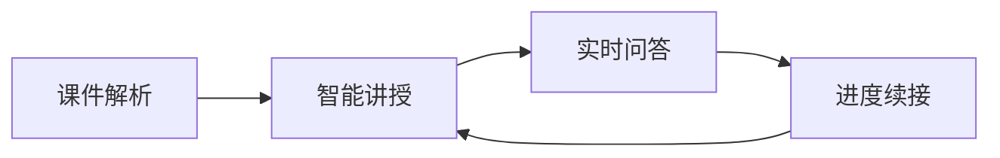
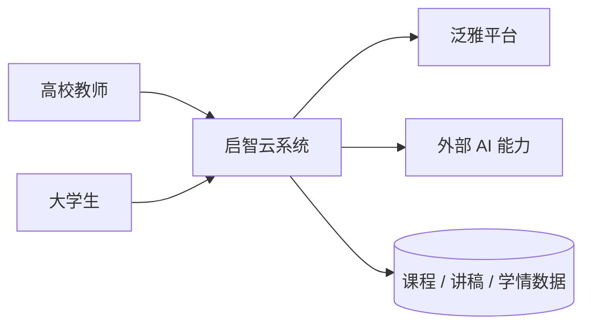
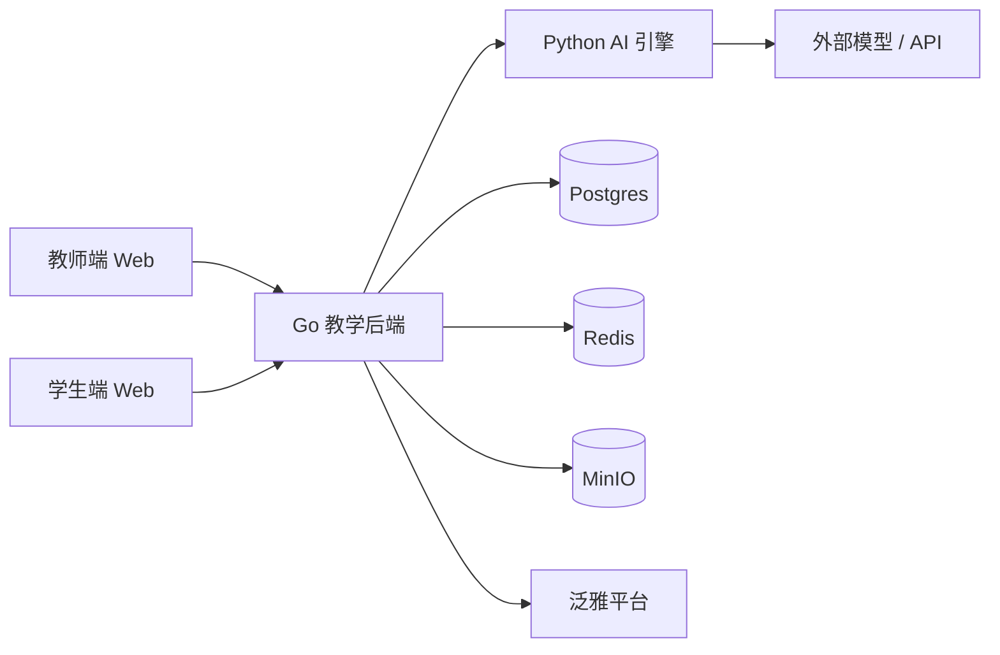
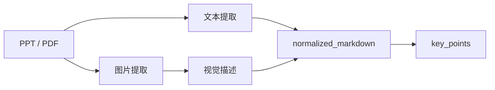
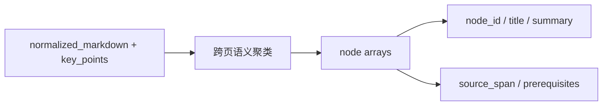
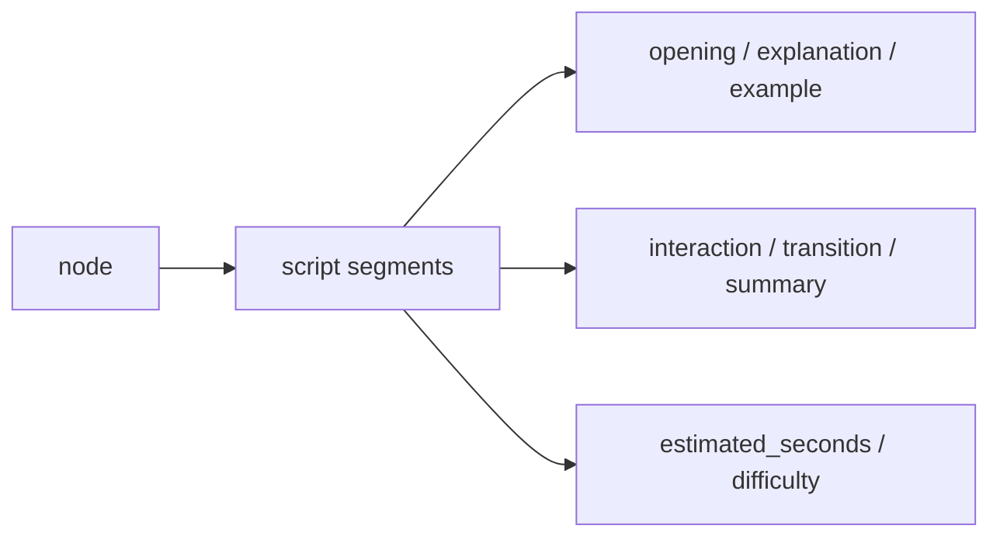
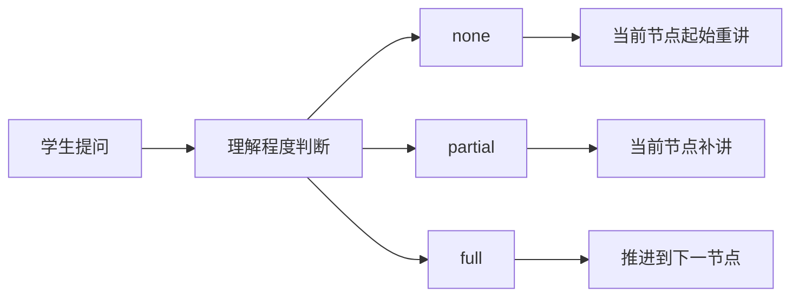
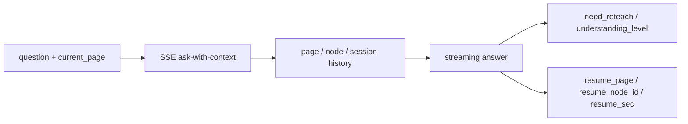
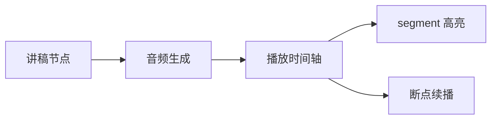

# 基于泛雅平台的 AI 互动智课生成与实时问答系统

## 把静态课件升级成可讲授、可互动、可续学的 AI 智课闭环

- 项目定位：面向泛雅平台的教学辅助系统
- 主线结构：背景 → 痛点 → 架构 → 算法设计 → 场景案例
- 汇报目标：让评委快速看懂“我们到底解决了什么问题”

---

# 1. 背景

## AI + 教育已经从概念走向场景落地

- 泛雅平台已经沉淀了大量 PPT、PDF 等优质课件资源
- 但这些资源大多仍停留在“静态展示”阶段
- 真正需要解决的，不是再做一个聊天机器人，而是把课件转化成可学习内容
- 我们的判断是：课件资源本身有价值，关键在于如何把它们组织成教学闭环

---

# 2. 痛点分析

## 现有教学链路的三个核心断点

- **教师侧**：上传课件不等于形成可讲授课程，仍需额外整理讲稿、补充讲解
- **学生侧**：自主学习时遇到问题，没有及时响应，学习容易中断
- **模型侧**：通用大模型会答题，但缺少课程上下文和当前讲授位置

> 结论：题目的本质不是“做一个 AI 问答工具”，而是“做一个绑定课程内容、绑定学习过程、绑定理解状态的系统”。

---

# 3. 主线方案

## 我们把整个系统收敛成一条教学闭环

- 课件解析：把 PPT / PDF 变成结构化内容
- 智能讲授：把内容整理成更适合讲和学的脚本
- 实时问答：围绕当前页、当前节点回答问题
- 进度续接：问完以后还能继续往下讲，而不是结束

---

# 4. 系统架构 1

## C4 L1：先看系统边界，再看系统服务谁

- 系统边界内：启智云平台
- 边界外：泛雅平台、外部 AI 能力
- 设计重点：不是把 AI 画成中心，而是把它放进教学闭环里

---

# 5. 系统架构 2

## C4 L2：把前端、后端、AI 引擎和基础设施拆开

- 教师端 / 学生端：分别承载管理和学习交互
- Go 后端：负责接口、编排、状态、SSE
- Python AI 引擎：负责解析、聚合、生成、问答
- 数据基础设施：承载课程、状态、文件和音频资产

---

# 6. 算法设计 1

## 多模态课件理解：不只提取文本，还要理解图文信息

- PPTX：提取嵌入图片，再做视觉语义补充
- PDF：渲染页面图像，再结合视觉模型理解
- 输出不是纯文本，而是更贴近教学的结构化理解结果

---

# 7. 算法设计 2

## 跨页语义节点聚合：从“页”变成“知识点”

- 课件知识边界不一定等于页边界
- 一个概念可能跨 3 - 5 页才能讲完整
- 我们用节点化模型把碎片内容聚合成可讲授单元
- 这一步是后续讲稿生成和问答续接的基础

---

# 8. 算法设计 3

## 结构化讲稿生成：让 AI 输出能被教、能被改、能被续接

- 每个节点生成 2 - 4 个 segment，而不是一大段文本
- 每个 segment 统一带上结构化字段
- 关键字段包括：`segment_type`、`estimated_seconds`、`interaction_hint`、`knowledge_card`、`difficulty`、`segment_id`
- 这样既方便教师修改，也方便后续按 segment 精确续讲

---

# 9. 算法设计 4

## 三态理解与智能续接：问答不是终点，而是继续讲的起点

- 三态：`none`、`partial`、`full`
- 续接字段：`resume_page`、`resume_node_id`、`resume_sec`
- 逻辑目标：让问答真正嵌入学习过程，而不是把学习流程打断

---

# 10. 算法设计 5

## 流式问答：把上下文、页面和会话状态一起送进模型

- 问答采用 SSE 流式返回，降低体感时延
- 上下文不只是一轮对话，还包括当前页和历史状态
- 结果事件不只返回答案，还返回是否需要重讲和续接位置

---

# 11. 场景案例 1

## 教师端场景：从课件上传到可发布讲稿

1. 教师上传课件
2. 系统解析页面内容并生成节点
3. AI 生成结构化讲稿
4. 教师查看、编辑、调整
5. 发布到课程中

- 价值：把“课件”升级成“可讲授内容”
- 角色关系：AI 辅助教师，而不是替代教师

---

# 12. 场景案例 2

## 学生端场景：在当前页面提问，并继续学下去

1. 学生在某一页学习时发起提问
2. 系统结合当前页和上下文进行回答
3. 模型判断理解程度
4. 系统决定是补讲、重讲还是继续推进

- 价值：把“答完就结束”变成“答完还能接着学”
- 关键体验：学习过程不中断，知识点能够接回去

---

# 13. 场景案例 3

## 音频播放与时间轴同步：让讲稿真正变成可听、可看、可定位的内容

- 教师可以对当前节点生成音频
- 播放时按 segment 做时间轴高亮
- 学生可以从某个知识节点继续播放
- 音频生成失败时可走 fallback，再重试补齐

---

# 14. 验证结果

## 我们不只做了方案，还完成了端到端验证

| 流程 | 结果 | 说明 |
| --- | --- | --- |
| 上传课件 | 通过 | 课件可进入解析与生成链路 |
| 生成讲稿 | 通过 | 节点化讲稿能够落库和编辑 |
| 生成音频 | 通过 | 缺节点时可回写最小节点后重试 |
| 问答续接 | 通过 | `current_page` 进入上下文后可正常返回 |

- 对应验证产物：`smoke_test_results.json`
- 含义：核心教学闭环已跑通，不只是单点功能演示

---

# 15. 创新点 1 & 2

## 让系统从“单次生成”升级成“可编排的教学内容体系”

- **创新点 1：可编程讲授脚本语言**
  - segment 粒度控制讲授节奏
  - 让讲稿能被编辑、续接和播放
- **创新点 2：跨页语义节点聚合**
  - 课件按知识点组织，而不是按页面切碎
  - 更适合讲授和问答定位

---

# 16. 创新点 3 & 4

## 让系统真正理解课件，并且理解学生当前学到哪里

- **创新点 3：多模态课件理解**
  - 文本、图片、流程图、图表一起进理解链路
- **创新点 4：LLM 意图驱动的三态理解与智能续接**
  - `none / partial / full` 三态比二态更贴近真实教学
  - `resume_page / resume_node_id / resume_sec` 支持精确续接

---

# 17. 设计取舍

## 为什么这样做，而不是做成一个通用聊天机器人

- Go 做业务中台，Python 做 AI 引擎：职责清晰，便于迭代
- AI 作为适配层，而不是架构中心：模型可换，核心业务不动
- 问答必须支持 SSE 和续接：教学场景不是一次性问答
- 开放接口和内部接口分离：便于平台对接，也便于后续演进

> 这也是企业级 C4 架构真正想表达的内容：系统边界、可演进单元和职责边界。

---

# 18. 后续工作

## 下一步最值得继续做的三件事

1. 扩大课件样本和场景样本，继续验证泛化能力
2. 补强学习分析、知识薄弱点定位和个性化推荐
3. 继续完善平台集成、资源调度和异常降级策略

> 方向总结：从“能跑通”走向“能规模化复用”。

---

# 19. 致谢

## 谢谢各位评委老师

### 我们最终想表达的一句话是：

> 我们没有把系统画成一个通用的分层图，而是按 C4 模型把启智云拆成上下文、容器和组件三层，让架构真正服务于“课件结构化、上下文问答、学习续接和学情闭环”这四个核心问题。

- 欢迎提问
- 我们会优先回答“为什么这样设计”和“它具体解决了什么问题”
