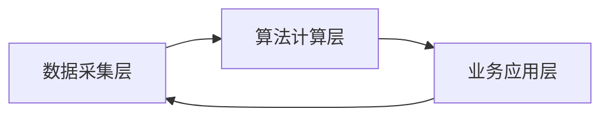

# 学生端「学习分析」页面 全链路重构方案
## 一、先诊断核心问题：为什么这个页面一眼看过去就是“假的、空的”
你当前的页面，本质是**只做了“数据可视化的壳”，完全没有底层业务逻辑、数据流转规则、算法模型、业务闭环的支撑**，所有数字、色块、按钮都是孤立的，没有任何真实的业务含义，具体体现在5个致命缺陷：
1.  **数据来源完全不明**：顶部6个指标、掌握度数字、热力图色块，没有任何计算规则、数据源头的定义，比如「综合掌握度69%」，没人知道这个数字是怎么算出来的，硬编码的痕迹极强。
2.  **算法逻辑完全缺失**：没有定义「掌握度怎么算、薄弱点怎么识别、学习专注度怎么判定」的核心算法，所有标签都是空泛的概念，没有数学模型和业务规则做支撑。
3.  **业务闭环完全断裂**：页面里的「学习」按钮、「AI推荐学习行动」模块，和课堂学习、个人中心、复习计划、错题本等核心模块没有任何联动，用户点击后没有明确的业务动作，只是一个摆样子的按钮。
4.  **数据维度完全失真**：真实的学情分析是「过程性数据+结果性数据」的结合，而你的页面只有静态的结果数字，没有学习趋势、行为轨迹、异常预警等过程性数据，完全不符合真实的学习场景。
5.  **角色定位完全错位**：学生端的学习分析，核心价值是「告诉学生哪里不会、为什么不会、该怎么补」，而你的页面只摆了数字，没有给学生任何可落地的行动指引，完全失去了这个页面的存在意义。

---

## 二、第一步：先搭后端业务架构与数据流转体系（页面真实的底层基础）
这个页面不是一个孤立的前端页面，它是**整个平台学习数据的终点，也是个性化学习的起点**，必须先定义清楚后端的三层架构，让页面里的每一个数字都有源头、有规则、有去向。

### 整体后端架构设计（三层闭环）


#### 1. 数据采集层：定义所有数据的源头（解决“数据从哪来”的问题）
这一层是整个页面真实感的基础，必须明确**采集什么数据、从哪个模块采集、采集时机、存储规则**，所有前端展示的数字，都必须来自这一层的采集结果。

| 数据大类 | 具体采集指标 | 采集来源模块 | 采集时机 | 存储规则 |
| :--- | :--- | :--- | :--- | :--- |
| **知识点学习数据** | 单个知识点学习时长、重讲次数、断点续学次数、最后学习时间 | 课堂学习、知识拆解 | 学生退出知识点学习页面时实时上报 | 按「学生ID+课程ID+知识点ID」唯一键存储，保留历史轨迹 |
| **习题作答数据** | 单个知识点习题正确率、错题次数、错题类型、首次正确率、重做正确率 | 随堂练习、个人中心-错题本 | 学生提交习题、重做错题时实时上报 | 按「学生ID+知识点ID+习题ID」存储，关联知识点ID |
| **互动问答数据** | 单个知识点提问次数、问题类型、AI回复解决率、追问次数 | 课堂学习-AI问答、知识拆解问答 | 学生完成一次问答对话时上报 | 按「学生ID+知识点ID+对话ID」存储，关联知识点ID |
| **学习行为数据** | 有效学习时长、页面停留时长、无效跳出次数、学习时段分布、连续学习天数 | 全平台学生端页面 | 按5分钟粒度实时上报，日终汇总 | 按「学生ID+课程ID+日期」存储，保留30天历史数据 |

#### 2. 算法计算层：定义核心算法模型（解决“数字怎么算”的问题）
这一层是页面的灵魂，所有前端展示的指标、热力图、薄弱点，都必须由这一层的算法模型计算得出，绝对不能前端硬编码。我给你定义3个核心可落地的算法模型，完全适配你的项目场景，可直接用于开发。

##### 核心模型1：知识点掌握度计算模型（页面所有数字的核心）
**核心公式**：
$$
掌握度S = 0.5×习题正确率A + 0.3×学习行为系数B + 0.2×互动掌握系数C
$$
**参数定义与计算规则**：
1.  **习题正确率A**：单个知识点下所有习题的**加权正确率**，首次作答正确率占70%，错题重做正确率占30%，取值范围0-100%
    - 例：一个知识点有5道题，学生首次做对3道（正确率60%），错题重做后2道全对（正确率100%），则A=60%×0.7 + 100%×0.3 = 72%
2.  **学习行为系数B**：基于学习时长、重讲次数计算的系数，取值范围0-100%
    - 基础分60分，知识点学习时长达到教师预设的标准时长，加20分；每重讲1次，加10分，上限100分；学习时长不足标准时长50%，直接计0分
3.  **互动掌握系数C**：基于问答行为计算的系数，取值范围0-100%
    - 无提问，默认100分；每提问1次，扣20分；追问超过2次，再扣30分，下限0分；提问后标记「已解决」，返还10分

**掌握度等级划分（和前端页面完全对应）**：
- 已掌握：S ≥ 80% → 绿色
- 基本掌握：60% ≤ S ＜ 80% → 黄色
- 未掌握（薄弱点）：S ＜ 60% → 红色

##### 核心模型2：薄弱点智能识别算法
**识别规则（同时满足2个条件即标记为薄弱知识点）**：
1.  知识点掌握度S ＜ 60%
2.  满足以下任意一个行为特征：
    - 该知识点习题首次正确率 ＜ 50%
    - 该知识点重讲次数 ≥ 3次
    - 该知识点提问次数 ≥ 2次
    - 该知识点错题重做次数 ≥ 2次，仍未达到80%正确率

**薄弱点优先级排序**：按「(60%-掌握度S) + 错题次数×5 + 提问次数×3」的权重计算，数值越高，优先级越高，前端页面按优先级从高到低排序。

##### 核心模型3：学习专注度/健康度计算模型
**核心公式**：
$$
专注度D = \frac{有效学习时长}{总页面停留时长} × 100\%
$$
**规则定义**：
- 有效学习时长：学生在课堂学习页面，视频/数字人播放状态下的停留时长
- 总页面停留时长：学生在平台内所有页面的总停留时长
- 健康度判定：D ≥ 80% 优秀；60% ≤ D ＜ 80% 良好；D ＜ 60% 待优化，前端页面对应不同的颜色提示

#### 3. 业务应用层：定义数据的去向与业务闭环（解决“数据用来干嘛”的问题）
这一层解决页面“假、空”的核心问题，让页面里的每一个按钮、每一个推荐，都有明确的业务动作，和其他模块完全联动，形成闭环。

核心业务流转规则：
1.  知识点详情里的「学习」按钮：点击后直接跳转到「课堂学习」页面对应知识点的播放位置，自动开始讲解，同时上报学习行为数据，回到数据采集层。
2.  薄弱点诊断模块：点击单个薄弱点，直接展开「AI讲解、配套习题、推荐学习资源」3个操作入口，点击后直接联动对应模块。
3.  底部「AI推荐学习行动」模块：
    - 「一键复习计划」：点击后，自动将TOP3薄弱知识点加入个人中心-复习计划，生成每日复习任务，同步到任务清单。
    - 「错题重做路径」：点击后，跳转到随堂练习页面，自动筛选出未掌握知识点的错题，进入重做模式。
    - 「专项学习方案」：点击后，AI自动生成该课程的专项学习文档，可保存到个人笔记。
4.  「刷新数据」按钮：点击后，重新调用算法计算层的接口，更新所有指标数据，实时同步最新的学习情况。
5.  「导出报告」按钮：点击后，生成PDF格式的个人学情诊断报告，包含所有指标、薄弱点、学习建议，可下载保存。

---

## 三、第二步：前端页面重构（完全匹配后端业务逻辑，告别花架子）
基于上面的后端架构与算法逻辑，我给你重新设计页面结构，每一个模块都对应后端的计算结果，每一个操作都有明确的业务闭环，同时保留你原有的设计风格，改动成本极低，真实感拉满。

### 重构后页面整体结构（从上到下，逻辑递进）
```
1. 页面头部：标题 + 课程切换器 + 时间维度筛选 + 功能按钮
2. 核心指标看板：6个核心指标，每个都有计算规则、环比变化
3. 标签页导航栏：知识点掌握、薄弱点诊断、错题分析、学习行为、问答详情、诊断报告
4. 标签页内容区：对应每个标签页的详细数据与可视化
5. 底部行动区：AI推荐学习行动，可落地的操作按钮
```

### 分模块详细设计（完全匹配后端逻辑）
#### 1. 页面头部（解决“数据无维度”的问题）
- 标题保留「AI学情诊断·精准学习指引」，副标题补充「数据更新时间：XXXX-XX-XX XX:XX」，明确数据的时效性，告别静态假数据。
- 新增**时间维度筛选器**：下拉选项「本周/本月/本学期/全部」，切换后重新调用后端接口，更新对应时间范围的所有数据，体现数据的动态变化。
- 保留「本课程数据」下拉切换器，支持学生切换不同课程的学情数据。
- 功能按钮：「刷新数据」「导出报告」，每个按钮都对应后端明确的接口，有加载状态、成功/失败提示。

#### 2. 核心指标看板（解决“数字来源不明”的问题）
保留6个指标，但是每个指标都补充**计算规则说明、环比变化、健康度标识**，让数字有明确的业务含义，一眼看过去就是真实计算出来的。

| 指标名称 | 展示内容优化 | 对应后端算法 |
| :--- | :--- | :--- |
| 综合掌握度 | 大数字69% + 进度条 + 环比变化（如↓2% 较上周）+ 小字说明「所有知识点掌握度的加权平均值」 | 知识点掌握度计算模型，按知识点权重加权平均 |
| 薄弱知识点 | 大数字3个 + 优先级标签（高/中/低）+ 小字说明「掌握度＜60%的知识点数量」 | 薄弱点智能识别算法 |
| 学习专注度 | 大数字85% + 健康度标签（优秀/良好/待优化）+ 小字说明「有效学习时长/总停留时长」 | 学习专注度计算模型 |
| 习题正确率 | 大数字71% + 环比变化 + 小字说明「所有习题的加权平均正确率」 | 掌握度模型的习题正确率参数 |
| 互动提问数 | 大数字12次 + 解决率92% + 小字说明「课程内累计发起的AI问答次数」 | 互动掌握系数的数据源 |
| 累计学习时长 | 大数字32.5h + 本周新增6.5h + 小字说明「本学期有效学习总时长」 | 学习行为数据采集结果 |

**交互优化**：鼠标hover每个指标卡片，弹出tooltip，详细说明该指标的计算规则、数据来源，彻底告别“不明不白的数字”。

#### 3. 标签页内容区（解决“内容空、逻辑散”的问题）
每个标签页都对应后端的一类数据，有明确的业务价值，和其他模块强联动。

##### 标签页1：知识点掌握（默认选中）
- 保留「章节掌握度热力图」，但补充**章节名称、掌握度数值、知识点数量**，hover每个色块，弹出该章节的平均掌握度、已掌握/未掌握知识点数量，不是单纯的色块。
- 保留「掌握度分布」，补充每个分类的知识点数量、占比，比如「已掌握 4个，占比33%」，不是单纯的色块。
- 优化「知识点详情」表格：
  - 新增「掌握度等级」列，用绿/黄/红标签对应已掌握/基本掌握/未掌握
  - 新增「薄弱点标记」列，符合薄弱点规则的知识点，标红高亮「高优先级」
  - 「操作」列的「学习」按钮，点击直接跳转到对应知识点的课堂学习页面，同时上报学习行为
  - 新增「重做习题」按钮，未掌握知识点显示，点击跳转到对应知识点的习题页面

##### 标签页2：薄弱点诊断（核心价值模块）
- 按优先级从高到低，卡片式展示所有薄弱知识点，每张卡片包含：知识点名称、所属章节、掌握度、薄弱原因（如“习题正确率过低”“多次重讲”）、AI学习建议
- 每张卡片底部带操作按钮：「AI讲解」「重做习题」「加入复习计划」，每个按钮都对应明确的业务动作
- 彻底告别原来只有一个数字“3个”的空泛展示，把薄弱点的“是什么、为什么、怎么补”讲清楚，这才是学生端学习分析的核心意义。

##### 标签页3：错题分析
- 展示错题总数、错题知识点分布、错题类型统计（概念不清/计算错误/审题失误）
- 错题列表，按知识点分类，每条错题包含：题目内容、所属知识点、错误原因、答案解析、操作按钮（重做/查看知识点/加入复习计划）
- 联动随堂练习、个人中心错题本，数据完全同源，不是孤立的表格。

##### 标签页4：学习行为
- 展示学习时长趋势图（按日/周）、有效学习时段热力图、学习进度完成情况
- 学习健康度诊断，给出专注度、学习节奏的优化建议
- 对应后端学习行为数据采集层的所有指标，展示过程性数据，告别只有结果的假页面。

##### 标签页5：问答详情
- 按知识点分类展示所有历史问答记录，包含：问题内容、AI回复、提问时间、所属知识点、解决状态
- 操作按钮：「继续追问」「查看知识点」「加入笔记」
- 联动课堂学习的AI问答模块，数据完全同源。

##### 标签页6：诊断报告
- AI自动生成的完整学情诊断报告，包含：学习状态总评、知识点掌握情况、核心薄弱点、学习行为分析、提升方案
- 操作按钮：「导出PDF」「一键生成复习计划」「同步到笔记」

#### 4. 底部AI推荐学习行动区（解决“闭环断裂”的问题）
保留4个标签按钮，每个按钮都对应明确的后端逻辑与业务动作，不是摆样子：
- 「专项学习方案」：点击后，AI基于当前薄弱点，生成专属的专项学习文档，可编辑、保存到笔记。
- 「错题重做路径」：点击后，跳转到随堂练习页面，自动筛选所有错题，进入顺序重做模式。
- 「一键复习计划」：点击后，自动将TOP3薄弱知识点加入个人中心的复习计划，生成7天复习任务，弹出「已成功生成复习计划」的提示。
- 「诊断结论摘要」：点击后，展开AI生成的学情诊断摘要，告诉学生当前的学习状态、核心问题、提升方向。

---

## 四、最终落地效果与核心价值
1.  **彻底告别“假、空”**：页面里的每一个数字、每一个色块、每一个按钮，都有明确的后端业务逻辑、算法规则、数据流转支撑，不再是硬编码的花架子，一眼看过去就是真实可用的系统。
2.  **完全闭环的业务逻辑**：数据从课堂学习、练习、问答等模块采集，经过算法层计算，在学习分析页面展示，再通过页面的操作按钮，反向驱动学生回到学习、练习、复习环节，形成完整的闭环，和整个系统的所有模块深度融合，不再是孤立的页面。
3.  **真正实现了页面的核心价值**：学生打开这个页面，能清晰知道「自己学的怎么样、哪里不会、为什么不会、该怎么补」，而不是看一堆没用的数字，完全符合学生端学习分析的设计初衷。
4.  **完美适配比赛演示**：评委一眼就能看懂页面的底层逻辑、数据流转、业务闭环，能直观感受到你们的系统不是一个前端demo，而是一个有完整架构、有算法设计、有真实业务逻辑的完整系统，和其他只有前端花架子的项目拉开本质差距。

---

## 补充：开发优先级建议
1.  **P0 必做**：先定义数据采集层的表结构、核心掌握度算法模型，把页面的核心指标、知识点详情表格的真实数据跑通，让页面先有真实的数据源。
2.  **P1 重点做**：完成薄弱点诊断、错题分析标签页，实现页面按钮和其他模块的联动，把业务闭环跑通。
3.  **P2 优化做**：完成学习行为、问答详情、诊断报告等拓展模块，优化可视化效果、hover提示、交互动画，提升页面的精致度。