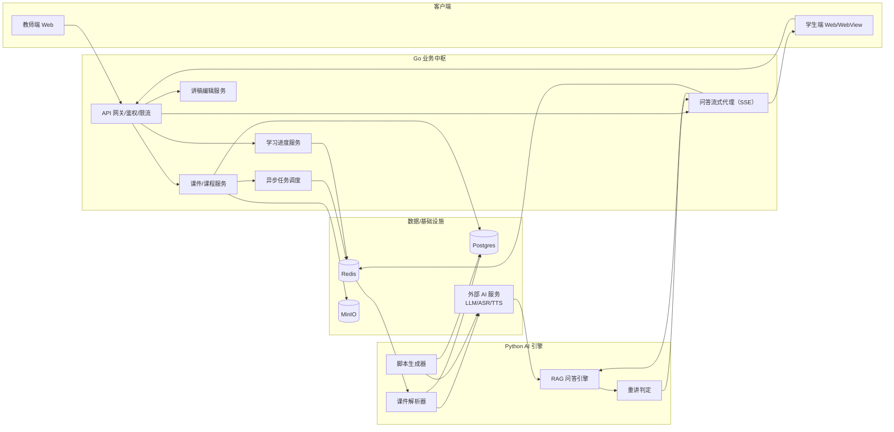

# 泛雅 AI 互动智课系统 - 开发与联调全手册
## 一、核心目标与约束
### 1.1 核心目标
将教师上传的 PPT/PDF 自动解析为结构化“可讲授脚本”，支持学生端文字/语音打断提问，AI 结合课件上下文高相关回答，并在问答结束后智能续接讲授进度。

### 1.2 硬约束
| 维度 | 约束要求 |
|------|----------|
| 算力 | 服务器 8C16G，禁止本地常驻大模型；LLM/Vision/ASR/TTS 依赖外部商业 API |
| 时延 | 问答响应（体感）≤5 秒，学生端问答必须支持 SSE 流式输出 |
| 解析 | 单份课件解析 ≤2 分钟（异步）；知识点识别 ≥80%；答案准确率 ≥85% |
| 集成 | 可嵌入泛雅 Web/学习通 WebView，接口支持异步调用 |

## 二、系统架构与职责划分
### 2.1 整体逻辑架构


### 2.2 核心模块职责映射
| 模块分类 | 具体模块 | 核心职责 | 代码/部署位置 |
|----------|----------|----------|---------------|
| 前端 | 教师端 | 课件上传/列表/删除、讲稿编辑、解析状态展示 | teacher-frontend（Vue+Vite） |
| 前端 | 学生端 | 课件播放、文字/语音提问、SSE 流式展示、续接播放 | ai-vue-frontend（Vue+Vite） |
| Go 后端 | API 网关 | 统一鉴权、限流、日志、请求转发 | cmd/api/main.go（Gin 路由） |
| Go 后端 | 课件服务 | 课件元数据管理、MinIO 存储编排、解析任务触发 | internal/service/course.go |
| Go 后端 | 进度服务 | Redis 维护学习状态（页码/节点/中断/续接） | internal/repository/redis.go |
| Go 后端 | SSE 问答代理 | 前端 SSE 连接管理、Python 流透传、错误处理 | internal/handler/qa_stream.go |
| Go 后端 | 异步任务调度 | 解析任务入队/出队、状态更新 | internal/service/job.go |
| Python 引擎 | 课件解析器 | PDF/PPT 拆页、结构化提取、统一 Schema 输出 | ai_engine/parser.py |
| Python 引擎 | 脚本生成器 | 页级脚本生成（opening/explain/transition） | ai_engine/generate.py |
| Python 引擎 | 问答引擎 | 上下文检索、流式回答生成、溯源/续接指令输出 | ai_engine/qa.py |
| 基础设施 | Postgres | 结构化数据存储（课程/讲稿/日志） | docker-compose.yml 容器 |
| 基础设施 | Redis | 任务队列、进度状态机、Session 缓存 | docker-compose.yml 容器 |
| 基础设施 | MinIO | 课件文件/预览图/音频存储 | docker-compose.yml 容器 |

### 2.3 关键数据结构约定
#### （1）页级脚本 JSON 结构（存储/传输标准）
```json
{
  "course_id": "课程唯一标识",
  "page_index": 1,
  "nodes": [
    {"node_id": "p1_n1", "type": "opening", "text": "开场白内容"},
    {"node_id": "p1_n2", "type": "explain", "text": "核心讲解内容"},
    {"node_id": "p1_n3", "type": "transition", "text": "过渡语内容"}
  ],
  "page_summary": "本页内容摘要（用于检索）"
}
```

#### （2）SSE 事件帧约定（前端/后端统一）
| 事件类型 | 数据格式 | 用途 |
|----------|----------|------|
| token | `{"text":"单个token/小片段文本"}` | 前端打字机效果展示 |
| sentence | `{"text":"完整分句文本"}` | 触发 TTS 分句播放 |
| final | `{"need_reteach":false,"resume_page":2,"resume_node_id":"p2_n3","source_page":2}` | 问答结束，返回续接/重讲指令 |
| error | `{"message":"错误描述","trace_id":"链路ID"}` | 异常反馈，便于排查 |

## 三、开发规划与里程碑
### 3.1 里程碑拆解
| 里程碑 | 核心目标 | 关键能力要求 |
|--------|----------|--------------|
| M1（MVP 闭环） | 教师上传课件→解析生成脚本→学生问答续接 | 1. 课件上传/存储/解析异步化<br/>2. 页级脚本可编辑保存<br/>3. 学生端 SSE 文字问答+续接 |
| M2（性能体验） | 问答时延≤5s，解析稳定性提升 | 1. SSE 多事件帧支持<br/>2. Go 问答代理超时/重连<br/>3. 解析任务限并发 |
| M3（语音交互） | 语音打断+语音回答+重讲节奏调整 | 1. ASR 语音输入<br/>2. TTS 分句播放<br/>3. need_reteach 逻辑落地 |

### 3.2 角色交付物清单
| 角色 | 核心交付物 | 验收基准 |
|------|------------|----------|
| Go 后端 | 1. 课件上传→MinIO→Postgres 落库<br/>2. 解析任务 Redis 队列<br/>3. 学生端 SSE 问答接口<br/>4. Redis 学习进度状态机<br/>5. 问答/解析日志落库 | 1. 上传后状态同步更新<br/>2. SSE 可透传测试数据<br/>3. 进度游标可精准读写 |
| Python AI | 1. 课件解析+脚本生成（离线可验收）<br/>2. 流式问答（RAG+溯源+续接指令）<br/>3. 数据契约（字段）稳定性 | 1. debug_harness.py 测试全过<br/>2. 流式输出 token/sentence 连续<br/>3. 字段变更同步文档 |
| 前端（教师端） | 1. 课件管理（上传/列表/删除/发布）<br/>2. 页级讲稿编辑/保存<br/>3. 解析状态展示+重试 | 1. 操作后数据持久化<br/>2. 解析状态实时同步 |
| 前端（学生端） | 1. 课件播放器（页预览+节点高亮）<br/>2. SSE 打字机 UI<br/>3. 问答后续接播放<br/>4.（M3）语音交互 | 1. 问答 2s 内开始出字<br/>2. 续接精准恢复到原节点 |

### 3.3 细化任务拆解（可导入看板）
| 任务ID | 任务描述 | 负责人 | 依赖 | 验收标准（DoD） |
|--------|----------|--------|------|----------------|
| G1 | 课件上传→MinIO 存储→Course 落库 | Go | MinIO/PG 环境就绪 | 教师端上传成功，列表可见 file_url |
| G2 | 解析任务入 Redis 队列，更新 Course 状态 | Go | G1 | Redis 可见 ParseJob，Course.status=parsing |
| P1 | Python Worker 消费 ParseJob，下载课件 | Python | G2 | 能从 MinIO 读取课件文件 |
| P2 | 解析课件输出统一 Schema JSON | Python | P1 | 输出包含 doc_id/total_pages/parsed_pages |
| P3 | 生成页级 nodes 脚本（opening/explain/transition） | Python | P2 | 每页至少 3 类节点，字段符合约定 |
| G3 | 解析结果写入 CoursePage/Postgres | Go/Python | P3 | 教师端可按页拉取并显示脚本 |
| F1 | 教师端：讲稿编辑页开发 | 教师端前端 | G3 | 编辑后保存，刷新仍保留内容 |
| G4 | 学生端 SSE 问答接口（空实现） | Go | - | EventSource 能收到测试 token |
| P4 | Python QA 流式输出（mock/LLM） | Python | - | 持续输出 token，结束输出 final 事件 |
| G5 | Go 透传 Python 流到前端 SSE | Go | G4/P4 | 前端看到完整流，断线返回 error |
| F2 | 学生端：SSE 打字机 UI 开发 | 学生端前端 | G4 | 输入问题后流式显示答案 |
| G6 | Redis 维护 current_page/node 状态 | Go | F2 | 问答前后游标正确更新 |
| F3 | 学生端：问答后续接播放 | 学生端前端 | G6 | 问答结束自动恢复到原节点 |

## 四、联调流程与验收标准
### 4.1 联调前置条件
1. 环境就绪：docker-compose.yml 启动 PG/Redis/MinIO；Go API / 前端 / Python 服务均可启动
2. 契约冻结：页级脚本 JSON 结构、SSE 事件帧、final 输出字段不再随意变更
3. 调试工具：Go 端日志可打印 trace_id；Python 端 debug_harness.py 可本地验证；前端可调试 SSE 消息

### 4.2 联调顺序（从最短链路开始）
| 联调阶段 | 链路范围 | 核心验收点 |
|----------|----------|------------|
| 阶段B：SSE 最短链路 | Go → 学生端 | 1. Go 模拟推送 10 个 token + 1 个 final<br/>2. 前端打字机效果正常，final 后UI标记“可续接” |
| 阶段C：Python 问答流 | Python → Go（无前端） | 1. Go 能逐段读取 token<br/>2. 结束能拿到 need_reteach/resume_* 字段 |
| 阶段D：全链路问答 | 学生端→Go→Python→Go→学生端 | 1. 输入问题 2s 内开始出 token<br/>2. final 字段可在前端调试面板查看 |
| 阶段E：续接功能 | 学生端→Go→Redis→学生端 | 1. 节点 A 打断问答→回答完→恢复到节点 A+1<br/>2. resume_page/node_id 精准生效 |
| 阶段F：解析链路 | 教师端→Go→Redis→Python→PG→教师端 | 1. 上传后状态=parsing，解析完成=ready<br/>2. 教师端可查看/编辑生成的脚本 |

### 4.3 统一验收标准
#### （1）功能验收
严格按照“任务拆解表”的 DoD 逐条验证，核心链路需端到端录屏留存。

#### （2）性能验收
| 指标 | 验收标准 | 测试条件 |
|------|----------|----------|
| 问答时延 | 首 token ≤2s，完整回答 ≤5s | 网络良好，单问答请求 |
| 解析时延 | 单份课件 ≤2min | 8C16G 服务器，限并发 1~2 个 |

#### （3）可观测性验收
1. 解析任务：每个任务有唯一 task_id，状态可查询
2. 问答请求：每个请求有 trace_id，日志包含 question/source_page
3. 错误场景：所有异常有明确 message + 关联 ID，便于定位

## 五、协作规范
### 5.1 会议与同步机制
1. 每日站会（10 分钟）：同步昨日交付物、今日计划、阻塞问题
2. 每周集成演示：跑通端到端链路（教师上传→解析→学生问答→续接）并录屏

### 5.2 变更管理
1. 接口/数据结构变更：必须先更新 API_DESIGN_V2.md，再提 PR
2. 服务部署变更：需同步更新 docker-compose.yml 或部署文档
3. 模型/依赖变更：Python 端需更新 requirements.txt，Go 端更新 go.mod

### 5.3 风险防护
1. 模型幻觉：问答结果必须携带 source_page，前端可展示“答案来源第 X 页”
2. 资源耗尽：解析任务限并发（1~2 个），Python 进程设置内存/超时上限
3. 网络异常：Go SSE 代理需处理断线重连，前端需兼容 SSE 断开后的重试逻辑

## 六、附录：参考文档
1. 全端统一 API 文档：API_DESIGN_V2.md（接口唯一真理源）
2. AI 引擎本地验收：ai_engine/README.md
3. 部署配置：docker-compose.yml